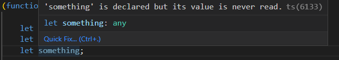

# Angular-From_Beginner_to_Expert
Based in Udemy course to learn Angular. This course was published several years ago, for this reason it is possible some Angular features / concepts are deprecated

# Section 1: Introduction and software
This course was published several years ago (Angular 7, currently versoin 15), for this reason it is possible some Angular features / concepts are deprecated, but the mainly Angular features work correctly.

## 1.1 Mandatory Software
- Node (https://nodejs.org/es), with **node -v** check version. Node install en Node Package Module, with **npm -v** check version.
- Google Chrome browser (https://support.google.com/chrome/answer/95346?hl=ES&ref_topic=7439538).
- TypeScript (https://www.typescriptlang.org/), with **tsc -v** check version
- Angular CLI ((https://angular.io/cli)), is the Angular manager, with **ng version** check version
- Ionic (https://ionicframework.com/)

## 1.2 Optional Software
- IDE's, Atom, Visual Studio Code, Sublime Text, WebStorm.
- Extesions for IDE's (PDF in course resources)


# Section 2: TypeScript and ES
- JavaScript no fue diseñado para crear aplicaciones de mediana y gran escala. Originalmente se diseñó para haver validaciones de formularios. Al ser un lenguaje de tipado débil, es fácil en aplicaciones de gran tamaño cometer errores. JavaScript carece de tipos de variables, rrrores en tiempo de escritura, etc. Lo peor es que con JavaScript no somos conscientes de lo problemas hasta que tiempo de ejecución.
- TypeScript solventa estos problemas de JavaScript. TypeScript compila el código y acaba generando JavaScript. Podemos tener la tranquilidad de trabajar con las ultimas novedades de ES que soporte TypeScript, ya que después al compilarlo, éste se encargará de pasarlo a la versión de JavaScript que indiquemos. Además TypeScript nos permite tener un código más ordenado y comprensivo.

## 2.2 TypeScript demo
- Para compilar código TS y generar el JS, usar el comando **tsc app.ts**, donde app.ts es el fichero TS a compilar.
- Para crear una **función anónima autoinvocada** (base del **patrón módulo** de JS):
  ``` 
  (function(){ ... })();
  ```
## 2.1 TypeScript configuration file
- Existe un fichero para configurar todo lo necesario en TS (esto Angular lo hace automáticamente). Con el comando **tsc --init**, esto crea el fichero de configuración **tsconfig.json**. Con este fichero ya creado, para compilar los TS existentes sólo hace falta ejecutar el comando **tsc -w**. The esta manera, TS se queda en modo "watcher", esto significa que, cada vez que se guarden cambios en un fichero TS, se compilarán generando / actualizando en JS correspondiente. Con "Ctrl+C" se pararía el servicio de autocompilación"


- El tsconfig.json posee muchas propiedades, al generarse sólo está activas algunas y con valores por defecto. Este archivo configura la manera de compilar los TS a JS. Cada propiedad viene explicada en el fichero.
- Como se comnentó anteriormente, en la implementación podemos usar características nuevas de JS (del ES que sea) y la compilación se encargará de pasarlo a la versión de JS que espeficiquemos (propiedad **target**). El estándar más aceptado es ES5.

## 2.2 Variables (let y const)
- Aunque el fichero TS tenga marque errores, el servicio de autocompilación lo compila. Si con un error por ejemplo en la declaración de una variable, ejecutamos el JS resultante, el navegador nos informará del error que ya nos estaba marcando TS.


- Dónde sea que hasta ahora se estuviese declarando en JS una variable tipo **var**, ahora se puede hacer tipo **let**. Las variables tipo **let** existen dentro de un scope determinado mientras que cno **var** no sucede esto.

<div align="center">


</div>

- El tipo **const** determina que una "variable" es constante y por tanto no se puede reasignar su valor. TS marcará el error y nos informará que ocurre. Pero al igual que antes, no restringe la compilación y el código JS dará error en tiempo de ejecución aunque su JS no marque error alguno. Es buena práctica usar constante porque necesitan menos espacio en memoria porque no tienen funciones para establecer valores. Por convención, su nombre se suele indicar en mayúscula del siguiente modo "MAX_CUSTOMERS".


## 2.3 Introduction to data type
- En TS se puede definir el tipo de variable al declararla, esto se hace también de manera "automática" al asignarle el valor. Es decir, si al crear una variable le asignamos una palabra, automaticamente TS entiende que es de tipo **string** sin necesidad de que nosotros le indiquemos el tipo, aunque es aconsejable por mantenimiento de código. Con esto, si se intenta cambiar el valor por otr tipo, **number** por ejemplo, TS marcará error. Si se intenta asignar un valor de tipo distinto al que se declaró la variable, TS marcará error.


- En TS existe el tipo de dato **any**, que puede ser cualquier cosa. Este tipo se asigna automáticamente cuando se declara una variable sin inicializarla, con lo que TS no sabe de qué tipo es. Una variable tipo any puede aceptar cualquier valor, es como una variable de JS, que no le afecta el tipado, TS no marcará error alguno. También se puede especificar que una variable pueda ser de uno u otro tipo con **|**.




- Cuando se declara un objeto inicializándolo y posteriormente se le asigna otro objeto, si este no cumple con la estrucutra **exacta** del inicial (propiedades y tipo) TS marcará error. Cuando digo **exacta**, quiero decir, que no se pueden ni añadir ni quitar propiedades al objeto de las definidas inicialmente.


## 2.4 Skip files to compile
- Es posible decirle a TS que el watcher omita ficheros/directorios a compilar. Para ello he movido el fichero TS usado para el estudio de los tipos de variables a la carpeta creada "typescript" y ene l tsconfig.json he especificado en un nuevo campo **exclude** el directorio que quiero omitir compilar. Por ello antes de activar el watcher (**tsc --w**) no tengo ningún JS generado y tras activarlo compila todo salvo la carpeta "typescript". En este caso genera sólo el app.js porque no hay más ficheros TS fuera de la carpeta "typescript".


## 2.5 String templates
- El uso de backtics (**``**) permite usar string templates para que la concatenación de strings no sea tan engorrosa. Permite que todo lo que esté entre los backtics se procese como un string sin necesidad de poner caracteres especiales con el \n para el salto de línea, pero también los permite. También permite añadir lógica en la template, es decir todo lo que esté entre **{}** se considera código JS. Comprando el TS con el JS se puede ver que la mejora a la hora de trabajar con string es evidente
 


## 2.6 Functions: Mandatory, Optional and Default parameters
- Es muy importante espeficicar el tipo de dato en los parámetros de una función al definirla. Normalmente el orden de definir los parámetros de una función es obligatorios, opcionales y por defecto.
  - Parámetro obligatorio: Se indica el nombre seguido de **:** y el tipo
  - Parámetro opcional: Se indica como un obligatorio pero el nombre del parámetro concatenado con **?**
  - Parámetro con valor por defecto: Se indica como un obligatorio seguido de **=** igual al valor por defecto


## 2.7 Arrow functions
- Definir una función como una variable de tipo constante me permite que no pueda ser modificada, es una buena práctica.
- Las funciones flecha fueron incluidas en ES6
- Las funciones flecha tienen la ventaja de que si sólo tiene una línea con return, se puede omitir poner las llaves de la función **{}** y el propio **return**.


- Las funciones flecha pueden solventar el problema del scope de las funciones tradicionales, es decir, el **this** cambia. Con las funciones arrow no se cambia el scope.

