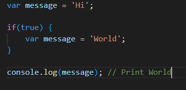
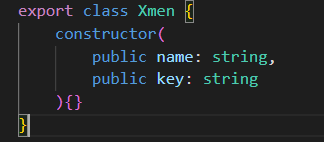
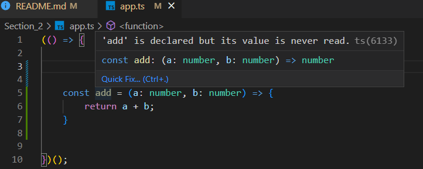

# Angular-From_Beginner_to_Expert
Based in Udemy course to learn Angular. This course was published several years ago, for this reason it is possible some Angular features / concepts are deprecated

# Section 1: Introduction and software
This course was published several years ago (Angular 7, currently versoin 15), for this reason it is possible some Angular features / concepts are deprecated, but the mainly Angular features work correctly.

## 1.1 Mandatory Software
- Node (https://nodejs.org/es), with **node -v** check version. Node install en Node Package Module, with **npm -v** check version.
- Google Chrome browser (https://support.google.com/chrome/answer/95346?hl=ES&ref_topic=7439538).
- TypeScript (https://www.typescriptlang.org/), with **tsc -v** check version
- Angular CLI ((https://angular.io/cli)), is the Angular manager, with **ng version** check version
- Ionic (https://ionicframework.com/)

## 1.2 Optional Software
- IDE's, Atom, Visual Studio Code, Sublime Text, WebStorm.
- Extesions for IDE's (PDF in course resources)


# Section 2: TypeScript and ES
- JavaScript no fue diseñado para crear aplicaciones de mediana y gran escala. Originalmente se diseñó para haver validaciones de formularios. Al ser un lenguaje de tipado débil, es fácil en aplicaciones de gran tamaño cometer errores. JavaScript carece de tipos de variables, rrrores en tiempo de escritura, etc. Lo peor es que con JavaScript no somos conscientes de lo problemas hasta que tiempo de ejecución.
  
- TypeScript solventa estos problemas de JavaScript. TypeScript compila el código y acaba generando JavaScript. Podemos tener la tranquilidad de trabajar con las ultimas novedades de ES que soporte TypeScript, ya que después al compilarlo, éste se encargará de pasarlo a la versión de JavaScript que indiquemos. Además TypeScript nos permite tener un código más ordenado y comprensivo.

## 2.2 TypeScript demo
- Para compilar código TS y generar el JS, usar el comando **tsc app.ts**, donde app.ts es el fichero TS a compilar.
- Para crear una **función anónima autoinvocada** (base del **patrón módulo** de JS):
  ``` 
  (function(){ ... })();
  ```
## 2.1 TypeScript configuration file
- Existe un fichero para configurar todo lo necesario en TS (esto Angular lo hace automáticamente). Con el comando **tsc --init**, esto crea el fichero de configuración **tsconfig.json**. Con este fichero ya creado, para compilar los TS existentes sólo hace falta ejecutar el comando **tsc -w**. The esta manera, TS se queda en modo "watcher", esto significa que, cada vez que se guarden cambios en un fichero TS, se compilarán generando / actualizando en JS correspondiente. Con "Ctrl+C" se pararía el servicio de autocompilación"


- El tsconfig.json posee muchas propiedades, al generarse sólo está activas algunas y con valores por defecto. Este archivo configura la manera de compilar los TS a JS. Cada propiedad viene explicada en el fichero.
  
- Como se comnentó anteriormente, en la implementación podemos usar características nuevas de JS (del ES que sea) y la compilación se encargará de pasarlo a la versión de JS que espeficiquemos (propiedad **target**). El estándar más aceptado es ES5.

## 2.2 Variables (let y const)
- Aunque el fichero TS tenga marque errores, el servicio de autocompilación lo compila. Si con un error por ejemplo en la declaración de una variable, ejecutamos el JS resultante, el navegador nos informará del error que ya nos estaba marcando TS.


- Dónde sea que hasta ahora se estuviese declarando en JS una variable tipo **var**, ahora se puede hacer tipo **let**. Las variables tipo **let** existen dentro de un scope determinado mientras que cno **var** no sucede esto.

<div align="center">




</div>

- El tipo **const** determina que una "variable" es constante y por tanto no se puede reasignar su valor. TS marcará el error y nos informará que ocurre. Pero al igual que antes, no restringe la compilación y el código JS dará error en tiempo de ejecución aunque su JS no marque error alguno. Es buena práctica usar constante porque necesitan menos espacio en memoria porque no tienen funciones para establecer valores. Por convención, su nombre se suele indicar en mayúscula del siguiente modo "MAX_CUSTOMERS".


## 2.3 Introduction to data type
- En TS se puede definir el tipo de variable al declararla, esto se hace también de manera "automática" al asignarle el valor. Es decir, si al crear una variable le asignamos una palabra, automaticamente TS entiende que es de tipo **string** sin necesidad de que nosotros le indiquemos el tipo, aunque es aconsejable por mantenimiento de código. Con esto, si se intenta cambiar el valor por otr tipo, **number** por ejemplo, TS marcará error. Si se intenta asignar un valor de tipo distinto al que se declaró la variable, TS marcará error.


- En TS existe el tipo de dato **any**, que puede ser cualquier cosa. Este tipo se asigna automáticamente cuando se declara una variable sin inicializarla, con lo que TS no sabe de qué tipo es. Una variable tipo any puede aceptar cualquier valor, es como una variable de JS, que no le afecta el tipado, TS no marcará error alguno. También se puede especificar que una variable pueda ser de uno u otro tipo con **|**.


- Cuando se declara un objeto inicializándolo y posteriormente se le asigna otro objeto, si este no cumple con la estrucutra **exacta** del inicial (propiedades y tipo) TS marcará error. Cuando digo **exacta**, quiero decir, que no se pueden ni añadir ni quitar propiedades al objeto de las definidas inicialmente.


## 2.4 Skip files to compile
- Es posible decirle a TS que el watcher omita ficheros/directorios a compilar. Para ello he movido el fichero TS usado para el estudio de los tipos de variables a la carpeta creada "typescript" y ene l tsconfig.json he especificado en un nuevo campo **exclude** el directorio que quiero omitir compilar. Por ello antes de activar el watcher (**tsc --w**) no tengo ningún JS generado y tras activarlo compila todo salvo la carpeta "typescript". En este caso genera sólo el app.js porque no hay más ficheros TS fuera de la carpeta "typescript".


## 2.5 String templates
- El uso de backtics (**``**) permite usar string templates para que la concatenación de strings no sea tan engorrosa. Permite que todo lo que esté entre los backtics se procese como un string sin necesidad de poner caracteres especiales con el \n para el salto de línea, pero también los permite. También permite añadir lógica en la template, es decir todo lo que esté entre **{}** se considera código JS. Comprando el TS con el JS se puede ver que la mejora a la hora de trabajar con string es evidente
 


## 2.6 Functions: Mandatory, Optional and Default parameters
- Es muy importante espeficicar el tipo de dato en los parámetros de una función al definirla. Normalmente el orden de definir los parámetros de una función es obligatorios, opcionales y por defecto.
  - Parámetro obligatorio: Se indica el nombre seguido de **:** y el tipo
  - Parámetro opcional: Se indica como un obligatorio pero el nombre del parámetro concatenado con **?**
  - Parámetro con valor por defecto: Se indica como un obligatorio seguido de **=** igual al valor por defecto


## 2.7 Arrow functions
- Definir una función como una variable de tipo constante me permite que no pueda ser modificada, es una buena práctica.
- Las funciones flecha fueron incluidas en ES6
- Las funciones flecha tienen la ventaja de que si sólo tiene una línea con return, se puede omitir poner las llaves de la función **{}** y el propio **return**.


- Las funciones flecha pueden solventar el problema del scope de las funciones tradicionales, es decir, el **this** cambia. Con las funciones arrow no se cambia el scope.


## 2.8 Destructure objetcs and arrays
- Es posible extraer partes de un objeto o de un array de manera simple.
- Para extraer sólo algunos campos de un objeto se usan **{}** y se pueden guardar directamente en variables. Para ello los nombres de las variables deben coincidir con el nombre del campo, pero da igual el orden de extracción.


- Es posible usar la extracción directamente en la definición de una función (en la imagen se marca como error porque no se especifica el tipo)


- Para extraer sólo algunos elementos de un array se usan **[]** y se pueden guardar directamente en variables. Para ellos los nombres de las variables pueden ser los que se quiera, pero aquí si que hay que respetar el orden. Si sólo se quiere extraer un elemento, habrá que seguir respentando el orden. Al igual que antes, también es posible usar la extracción directamente en una función (en la imagen no se marca como error porque aquí si se especifica el tipo)


## 2.9 Promises
- Las promesas principialmente permiten tener una gestión sobre la respuesta de llamadas asíncronas y fueron introducidas en ES6. Cuando se requiere trabajar con respuestas de llamadas asíncronas el código se llena de callbacks, que se ejecutan (normalmente) cuando la llamada asíncrona en cuestión responde. Las promesas, ayudan a que el código no esté cargado de callbacks y que cuando se requiera utilizar los datos de una llamada asíncrona, saber si ese datos está ya disponible o no.

- Al crear la promesa se le debe pasar función cuyo dos argumentos sean dos funciones, **resolve** y **reject**. El resolve se devuelve cuando todo funciona correctamente y el reject cuando algo falla.
  
- La promesa tiene dos funciones, **then** y **catch**. Usamos then cuando todo ha ido bien y catch cuando falla algo. Y se recibe lo que se pase como parametro en el resolve o el reject. El no manejar errores en las promesas pueden detener el flujo del programa como se ve en una de las siguientes imágenes.


- Hay que definir qué hacer en caso de que la promesa se resuelva bien y también mal.


- En el ejemplo si se juega con el delay del timout se podrá verifica que sólo se ejecuta una de las funciones que se le pasa a la promesa, la que llegue antes.


- Se puede simular la llamada a una función que retorne una promesa, esta se encargaría de solicitar a un servicio que hiciera algo (retirada de dinero en este caso) e implementar que hacer en caso de que la promesa se resuelva o falle. Además gracias a las función flecha puede quedar muy simple.


- Ahora mismo no hay control sobre el tipo de datos que devuelve la promesa, se indica que es desconocido (**unknown**). Para especificar esto en la función getMoney hay que definir el tipo de dato que se va a devolver, en este caso una promesa que si se resuelve será un number.


## 2.10 Intefaces
- Cuando se quiere acceder a propiedades de un objeto, no se puede estar seguro sin hacer una validación previa, que el objeto contenga dicha propiedad. Se podría indicar en una llamda que se manda un objeto y sus campos indicando el tipo de cada uno. De este modo si se intenta usar la función con un objeto que no cumpla al menos con los campos que se necesitan, se marcará error. Pero no es la mejor manera.


- Para tener un código robusto y además poder darle una entidad a los objetos, en TS se usan interfaces. Basicamente es poner reglas para asegurarse de cumplirlas. No existe una interpretación de interface TS en JS. Para definir las interfaces se usa la palabra reservada **interface**. En la siguiente imágen se puede ver como tras definir la interface TS nos avisa que no se está asignando una propiedad que posea la interfaz definida.


- Si por alguna razón en el futuro hay que cambiar el nombre de una propiedad, TS avisaría de todos los lugares donde se está usando.


- También puede ocurrir que se le añada una propiedad a la interfaz, esto maracará error en la creación del objeto de ese tipo. Pero se puede indicar que una propiedad sea opcional concatenando **?** al nombre del campo. En la siguiente imagen se puede ver como TS indica que faltan dos de las tres nueas propiedades, esto es porque una de ellas es opcional.


## 2.11 Clases en TS
- Las clases son soportadas en ES6. Las clases, en TS, se usan para definir tipos de datos que además pueden ejecutar ciertos métodos. Para definir una clase se usa la palabra reservada **class**. Aunque añadamos muchas propiedades en TS, hasta que estas no se inicializan, JS no las crea.


- Para inicializar los campos de la clase se puede hacer directamente en la declaración del campo pero es buena práctica hacerlo en el constructor ya que es posible necesitar ciertos valores para inicializar los campos. El constructor es una función que todas las clases tienen y que se invoca siempre que un objeto de esa clase es instanciado / creado. Se usa la palabra reservada **constructor**.


- En el constructor hay que tener el cuenta la visibilidad **public**, **private** o ninguna, como se ha visto hasta ahora, que se le da a una varible en el constructor, ya que si es **public** se creará como otro campo más de la clase y a su vez se inicializará con el valor que pasemos (por ello se suele usar para inyectar servicios), por ello no puede llamarse igual que un campo ya existente, y podrá ser accedida tanto desde dentro como desde fuera de la clase. Si es **private** pasará lo mismo que con public, con la única diferencia que este nuevo campo no podrá ser accedido desde fuera de la clase, será interno.


- Por lo que se usa el constructor no sólo para hacer lógica necesaria para inicializar el objeto, sino para crear campos de la propia clase. Indicando que algunas propiedades son opcionales, la instanciación del objeto no marcará error, pero se crearán las propieades igualmente.


- También se puede usar lo visto anteriormente en relación a parámetros por defecto, para así, en el caso de no informar una propiedad inicializarla a un valor.


## 2.12 Imports
- Aquí se va a ver cómo importar módulos. Este es algo que Angular ya hará de manera automática. En los recursos del curso hay una URL hacia GitHub de donde descargar un repositorio que servirá de base para estudia las importaciones. Este enlace lleva a un repositorio público de Fernando Herrera, creador del curso (https://github.com/Klerith/webpack-starter-typescript). Descargar el código como zip, descompirmirlo y renombrarlo como typescript-importer. Es un projecto TS por lo que se deberá trabajar con él en una carpeta diferente a la que hemos estado trabajando, ya que tendrá su propio tsconfig.json.
  
- Dentro de la carpeta del proyecto, desde una terminal, ejecutar **npm install**, esto instalará los módulos de dependecias descritos en el package.json. Después de la instalación aparecerá una carpeta nueva "node_modules" que es dónde se instalan las dependencias del proyecto.


- Para arrancar la aplicación se usa **npm start**. Lo que hace este "start" viene definido en el package.json, que en este caso, ejecuta **webpack-dev-server --open --port=8080**, es decir, arranca la apliación en el webpack (servidor), puerto 8080 y abre el navegador. Probablemente obtengas un error al intetar ejecutar este comando ya que este curso tiene ya algunos años y la versiones más modernas de Node son incompatibles con este webpack.He podido solventar el problema abriendo una consola de CMD (Windows) y añadiendo la siguente variable de entorno NODE_OPTIONS con el valor que se ve en la imagen. Y después ejecutando el **npm start**, pero todo ello desde el CMD y no desde la Terminal PS que abre mi IDE. Es posible que más adelante, en este curso, alla que borrar esta variable de entorno debido a que se ha añadido por la particularidad de esta sección y por ahora desconozco si generará algún conflicto con proyectos Angular.


```
set NODE_OPTIONS=--openssl-legacy-provider
```


- Una de las cosas buenas de trabajar con webpack es que cada vez que hacemos un cambio, actualiza automáticamente la pantalla.
  
- Esta sección se centra en las importaciones, para ello, vamos a ver como importar una clase. Crear un fichero donde definir una clase y anteponer la plabra reservada **export** para poder usarla en otros ficheros, sin poner el export sólo se podría usar en su propio fichero (privada). En el index.ts usar esta clase (sin importarla aún), TS marcará un error




- Para importar una clase no sólo es necesario que esta esté definida con el **export**, sino que dónde se quiera usar habrá que incar que la importamos, para ello se usa **import {...} from '...'**, dónde entre las {} se indica el nombre de la clase y tras el from la ruta dónde está definida. En la siguiente imagen se puede ver cómo ahora sí que reconoce la clase y TS nos indica que hay que añadir dos argumentos al constructor. Si se añaden métodos u otras propiedades, TS las reconoce y nos facilita la impmentación


- Hay más maneras de hacer importaciones, pero esta es la más común, el resto se irán viendo durante el curso según se necesiten.

## 2.13 Classes decorators
- Un decorador es una anotación (como en Java Spring) que se coloca antes de la clase y sirve para añadir funcionalidades / propiedades a la clase, como que es un componente, un servicio, etc, es decir, expande la clase. Para poder usarlos hay que inicar al TS que los habilite, para ello en el tsconfig.json descomentar la propiedad "experimentalDecorators" que está a true.


- Para que TS tome correctamente los cambios, habría que parar la aplicación y volver a levantarla, así el navegador ya no mostrará el error relacionado con los decoradores.

- Añadiendo una función y poniendola en el decorador, se puede ver en el navegador como se ejecuta el código de la función añadida en el decorador cuando se crea la clase.


- Angular hará las importaciones / decoraciones automáticamente. El fin de este curso no es crear decoradores, si no usar los que Angular ya provee, y este punto de la sección está para entender qué hacen.

## 2.14 Function return type
- Hasta ahora no se había especificado el tipo de dato que devuelve una función, aunque TS si que lo reconoce, como en el siguiente ejemplo de una función que suman dos números (sabe que devuelve un número), por lo que podríamos ahorrarnos el especificar el tipo. Para específicar hay que indicarlo usando los **:** justo después de la declaración de argumentos de la función. Esto se hace para evitar errores y devolver algo que no se quiera, como se dijo anteriormente, es poner reglas para asegurarse cumplirlas.




- Pero, hay ocasiones en las que TS no es capaz de reconocer el tipo de dato que se devuelve. Eso es lo que pasa si se devuelve por ejemplo una promesa, que no se sabe de qué tipo es. Y portanto no se podría tener un buen control sobre el dato duvelto cuando se resuelva / rechace.


# 3 WebApp: Hello World
En esta sección se va a realiar las primera aplicación Angular ("Hello World"). También se explicarán conceptos clave de Angular y se empezará a utilizar algunas instrucciones.

## Introduction to Components and Directives
- Las aplicaciones de Angular están basadas en múltiples componentes. Un componente es una pequeña clase que cumple una tarea específica. Contiene su propia lógica(TS), estructura (HTML) y estilo (CSS). Se aisla del resto de componentes, esto permite que sea reutilizable.
- Las directivas estructurales son instrucciones que indican a la parte del HTML qué tiene que hacer. Dos directivas de las más utilizadas son **\*ngIf** y **\*ngFor**. La primera se suele utilizar para pintar o no elementos del HTML y la segunda para construir elementos a partir de iterar objetos / arrays.
- Hay dos webs que son de gran ayuda a la hora de trabajar con Angular, una es su propia web https://angular.io/, donde encontrar toda la información sobre el framework. Y otra es un servicio que es un IDE en linea para probar rápidamente código con varios tipos de framworks, https://stackblitz.com/. En este servicio si pulsamos sobre la opción de Angular, arranca automaticament una aplicación ejemplo en Angular, dónde se puede ver la composición del proyecto, código y resultado.


- En el ejemplo de Stackblitz se puede ver varias cosas en relación a los componentes. En el index.html que es el HTML que se carga al inicio se usa una tag llamada **my-app**, esta tag no es de HTML, sino que es la tag que indica que se pinte el componente cuyo selector es el nombre de la tag. Si se mira el main.ts, aquí se declarar un componente (con el decorador @Component) cuya propiedad **selector** es 'my-app', por lo que será este componente el que se pinte en el index.html. Este ejemplo es un caso particular ya que el componente también posee la propiedad **template** que indica como se ha de pintar el componente, pero lo normal es tener esto en un fichero separado del TS del componente. En el HTML de un componente se puede acceder a las propiedades del mismo con llaves dobles **{{}}**, se denomina **interpolación**. De hecho, en Angular cuando se usan las llaves dobles se puede ejecutar lógica cómo se fuese un JS.


## Components
- Es una clase extendida, es decir, con más funcionalidades.
- Para crear un componente se usa la instrución de Angunar **ng g c nombreDelComponente** desde un terminal / consola de comandos (AngularCLI). Esto cerará por defecto 4 ficheros y actualizará el app.module.ts añadiendo el nuevo componente a los declarados (**declarations**).
  - HTML: Estructura del componente.
  - CSS: Estilo del componente.
  - TS: Lógica del componente
  - SPEC.TS: Para testing del componente
- Usa el decorador **@Component** que es importado del módulo **Component** en **@angular/core**.
- Propiedades relevantes:
  - selector: Indica el nombre de la tag para usar el componente dentro de un HTML
  - template: Estructura HTML del componente. Se usa cuando el HTML del componente es simple (1 o 2 líneas)
  - templateUrl: Ruta donde se encuentra el HTML que tiene la estructura del componente
  - styleUrls: Array de rutas de los CSS que usa el componente.


## Creating the WebApp
- Para crear una aplicación Angular (sirivendonos de AngularCLI) se usa el comando **ng new nombreDeLaApp**. Si en la generación de la aplicación pregunta si usar routing, contestar no, y en el tipo de estilo a usar, contestar CSS.


- Se instalarán todos los paquetes necesarios para crear la aplicación. Una vez instalados, en la terminal que se usa para los comandos se debe estar dentro de la carpeta creada para el proyecto, si no, no se reconocerán los comandos ng para trabajar en la aplicación.

- Para arrancar la aplicación, usar el comando **ng serve**. Esto levanta un servidor local en el purto 4200 por defect. Si después del comando se añade el atributo **-p** se puede cambiar el puerto, si se añade el atributo **-o**, abrirá directamente el navegador con la aplicación.


- Tras crear la aplicación y levantarla, siempre que se haga un cambio en ella que necesite renderizarse, esto se hará de manera automática.

- En la carpeta *src > app* es dónde se crea el componente principal de la aplicación, por así decirlo, el "componente aplicación". Si se modifica su app.component.html se verá como lo que renderiza la aplicación cambia.


## Project Structure
- <u>**e2e**</u> folder: En versiones antiguas de Angular, esta carpeta es la destinada al manejo de pruebas end to end, en este curso no se trabaja con ella. Usada para pruebas unitarias y de integración (se puede abordar en otro curso de **Fernando Herrera**)
- <u>**node_modules**</u> folder: Contiene los paquetes instalados al crear la aplicación, es decir, los módulos necesarios con el fin de desarrollo, cuando se cree la versión de producción de la aplicación no se incluye esta carpeta. Todos los módulos de Node están declarados (en el package.json) y si por algún caso se borrar la carpeta, haciendo **npm install** se volverían a instalar
- <u>**src**</u> folder: Es donde está la aplicación. Está compuesta por varias carpetas y ficheros.
  - **app** folder: Contiene el primer componente de Angular en la aplicación que se va a cargar. Dentro de ella están los diferente archivos de este componente: CSS que determina el estilo del componente, HTML que determina la estructura del componente, el SPEC que se usa para pruebas unitarias y el TS que indica el comportamiento del componente. El app.module.ts posee un decorador @NgModule que sirve para indicar que es un módulo y los componentes que posee.
  - **assets** folder: Dónde se colocan los archivos estáticos. Contiene el fichero **.gitkeep** que lo único que sirve es para que git siempre tenga en cuenta la carpeta assets, aunque esté vacía (no la ignore).
  - **index.html**: Es el index de la aplicación y de hecho invoca al app component para que sea renderizado (tag **\<app-root>**).
  - **main.ts**: Contiene el código que se va a lanzar primero al ejecutar la aplicación. Contiene una función (**platformBrowserDynamic**) para preparar el entorno para el tipo de aplicación que se va a ejecutar. Esto al crear aplicaciones para otros entornos, moviles por ejemplo, cambia un poco.
  - **styles.css**: Fichero de estilos globales de la aplicación.
- <u>**.editorconfig**</u>: Contiene configuraciones del editor.
- <u>**.gitignoer**</u>: Fichero que indica al repositorio de git que tipo de ficheros / carpetas debe ignorar para el vesionado.
- <u>**angular.json**</u>: Fichero que le indica a Angular como es nuestra aplicación y como funciona. En este arhivo basicamente se modifican tres cosas: asstes, styles y scripts.
- <u>**package-log.json**</u>: Fichero que indica al Node como fue creado el package.json. Este archivo se modifica de manera automática, no se toca manualmente.
- <u>**package.json**</u>: Este fichero es muy importante ya que contiene información de la aplicación y dependencias. Se va creando de  manera automatica según vamos trabajando en la aplicación.
- <u>**README.md**</u>: Fichero que se crea automáticamente y explica como funciona la aplicación.
- <u>**tsconfig.json**</u>: Indica a TS cómo trabajar.


## Using Boostrap in first component
- Para al primera aplicación se va a usar la librería bootsrap (https://getbootstrap.com/) para aplicar un CSS atractivo para la misma. Para ello no se va a instalar ninguna dependencia de bootsrap, sino que directamente se usará la librería (fichero) que tienen publicado importándolo es la aplicación vía CDN. Se añade al index.html de la aplicación.


- Este primer componente se creará de manera manual (no mediante el comando del AngularCLI), para así entender mejor como funciona Angular. La estructura que se suele seguir es crear una carpeta **components** dentro de **app** para almacenar todos los componentes y dentro de esta una carpeta por cada componente. Empezaremos por el "header". Dentro de la carpeta header es dónde se añadirán los archivos del componente.
  - header.component.ts: Para la lógica del componente.
  - header.component.html: Para la estructura visual del componente.
  - header.component.css: Para el estilo visual del component.
  - header.component.spec.ts: Para testear el componente.

- Hay que recordar que si la clase del componente no se exporta, no se podrá  importar y añadir a **declarations** en el app.module.ts y por tanto no se podrá usar en la aplicación con su selector.


- Ahora se va a hacer uso de bootstrap para darle un aspecto más atractivo a la aplicación, para ello se usará el *navbar* en un nuevo fichero que se llamarán header.component.html ya que la cantidad de código es mucho mayor al aconsejable poner en la propiedad **template**. Este será el que usará el componente, por lo que hay que referenciarlo en su TS, en la propiedad **templateUrl**.


- Se puede crear otro componente "body" dentro de la carpeta "app > components" para usarse después del "header", este debe tener su TS y su HTML, además deberá ser declarado en el app.module.tos, quedando de la siguiente manera:


- Habiendo visto lo tediso que es crear componentes de manera manual, es el momento de crearlos usando AngularCLI con el comando **ng g c nombreDelComponente** dentro de la carpeta del proyecto / aplicación Angular. Con el compando crear el "footer", creará 4 archivos y actualizará automaticamente el app.module.ts declarando el nuevo component.


- Para aplicar estilos globales de la aplicación se usa el style.css que cuelga directamente de la carpeta "src", está al mismo nivel que la carpeta "app".


- El siguiente paso es empezar a implementar el "body". Para ello se usará las *cards* y *lists* de bootstrap, además de modificar algo el css para que el aspecto de la aplicación quede mejor. Dejando de la siguiente manera los HTML's el aspecto de la página mejor mucho. Ya sólo quedaría aplicar directivas de Angular.


## Directives: *ngInf and *ngFor
- Las directivas estrucutrales son instrucciones que agregan, eliminan o reemplazan elementos HTML en la template.
- La directiva estructural *gnIf se suele utilizar para mostrar / ocultar algo del componente. Para ello se usa la directiva en el elemento que se desea mostrar / ocultar. Si la directiva es igual a true, mostrará en elemento, si es igual a false, lo ocultará. Hay que tener en cuenta que usando esta directiva, Angular lo que hace es destruir / recrear el objeto (no ocultarlo / mostarlo.). En el ejemplo, con el botón se puede cambiar el valor de la variable usada para mostrar u ocultar la zona de información. La directiva quedaría como **\*ngIf="showElement"**


- La directiva estructural *ngFor se usa pintar un mismo elemento / bloque de código varias veces con diferente información, normalmete recorriendo un array. La directiva quedaría como **\*ngFor="let element of list"**, pudiendo usar element para obetner la información. Dentro del *ngFor se puede acceder al indice (**index**) de la iteración que se está realizando.


