# Angular-From_Beginner_to_Expert
Based in Udemy course to learn Angular. This course was published several years ago, for this reason it is possible some Angular features / concepts are deprecated

# Section 1: Introduction and software
This course was published several years ago (Angular 7, currently versoin 15), for this reason it is possible some Angular features / concepts are deprecated, but the mainly Angular features work correctly.

## 1.1 Mandatory Software
- Node (https://nodejs.org/es), with **node -v** check version. Node install en Node Package Module, with **npm -v** check version.
- Google Chrome browser (https://support.google.com/chrome/answer/95346?hl=ES&ref_topic=7439538).
- TypeScript (https://www.typescriptlang.org/), with **tsc -v** check version
- Angular CLI ((https://angular.io/cli)), is the Angular manager, with **ng version** check version
- Ionic (https://ionicframework.com/)

## 1.2 Optional Software
- IDE's, Atom, Visual Studio Code, Sublime Text, WebStorm.
- Extesions for IDE's (PDF in course resources)


# Section 2: TypeScript and ES
- JavaScript no fue diseñado para crear aplicaciones de mediana y gran escala. Originalmente se diseñó para haver validaciones de formularios. Al ser un lenguaje de tipado débil, es fácil en aplicaciones de gran tamaño cometer errores. JavaScript carece de tipos de variables, rrrores en tiempo de escritura, etc. Lo peor es que con JavaScript no somos conscientes de lo problemas hasta que tiempo de ejecución.
  
- TypeScript solventa estos problemas de JavaScript. TypeScript compila el código y acaba generando JavaScript. Podemos tener la tranquilidad de trabajar con las ultimas novedades de ES que soporte TypeScript, ya que después al compilarlo, éste se encargará de pasarlo a la versión de JavaScript que indiquemos. Además TypeScript nos permite tener un código más ordenado y comprensivo.

## 2.2 TypeScript demo
- Para compilar código TS y generar el JS, usar el comando **tsc app.ts**, donde app.ts es el fichero TS a compilar.
- Para crear una **función anónima autoinvocada** (base del **patrón módulo** de JS):
  ``` 
  (function(){ ... })()
  ```
## 2.1 TypeScript configuration file
- Existe un fichero para configurar todo lo necesario en TS (esto Angular lo hace automáticamente). Con el comando **tsc --init**, esto crea el fichero de configuración **tsconfig.json**. Con este fichero ya creado, para compilar los TS existentes sólo hace falta ejecutar el comando **tsc -w**. The esta manera, TS se queda en modo "watcher", esto significa que, cada vez que se guarden cambios en un fichero TS, se compilarán generando / actualizando en JS correspondiente. Con "Ctrl+C" se pararía el servicio de autocompilación"


- El tsconfig.json posee muchas propiedades, al generarse sólo está activas algunas y con valores por defecto. Este archivo configura la manera de compilar los TS a JS. Cada propiedad viene explicada en el fichero.
  
- Como se comnentó anteriormente, en la implementación podemos usar características nuevas de JS (del ES que sea) y la compilación se encargará de pasarlo a la versión de JS que espeficiquemos (propiedad **target**). El estándar más aceptado es ES5.

## 2.2 Variables (let y const)
- Aunque el fichero TS tenga marque errores, el servicio de autocompilación lo compila. Si con un error por ejemplo en la declaración de una variable, ejecutamos el JS resultante, el navegador nos informará del error que ya nos estaba marcando TS.


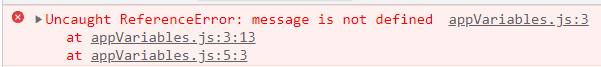

- Dónde sea que hasta ahora se estuviese declarando en JS una variable tipo **var**, ahora se puede hacer tipo **let**. Las variables tipo **let** existen dentro de un scope determinado mientras que cno **var** no sucede esto.

<div align="center">


</div>

- El tipo **const** determina que una "variable" es constante y por tanto no se puede reasignar su valor. TS marcará el error y nos informará que ocurre. Pero al igual que antes, no restringe la compilación y el código JS dará error en tiempo de ejecución aunque su JS no marque error alguno. Es buena práctica usar constante porque necesitan menos espacio en memoria porque no tienen funciones para establecer valores. Por convención, su nombre se suele indicar en mayúscula del siguiente modo "MAX_CUSTOMERS".


## 2.3 Introduction to data type
- En TS se puede definir el tipo de variable al declararla, esto se hace también de manera "automática" al asignarle el valor. Es decir, si al crear una variable le asignamos una palabra, automaticamente TS entiende que es de tipo **string** sin necesidad de que nosotros le indiquemos el tipo, aunque es aconsejable por mantenimiento de código. Con esto, si se intenta cambiar el valor por otr tipo, **number** por ejemplo, TS marcará error. Si se intenta asignar un valor de tipo distinto al que se declaró la variable, TS marcará error.

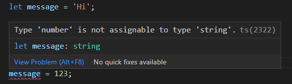

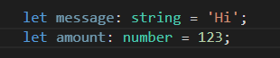

- En TS existe el tipo de dato **any**, que puede ser cualquier cosa. Este tipo se asigna automáticamente cuando se declara una variable sin inicializarla, con lo que TS no sabe de qué tipo es. Una variable tipo any puede aceptar cualquier valor, es como una variable de JS, que no le afecta el tipado, TS no marcará error alguno. También se puede especificar que una variable pueda ser de uno u otro tipo con **|**.


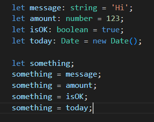


- Cuando se declara un objeto inicializándolo y posteriormente se le asigna otro objeto, si este no cumple con la estrucutra **exacta** del inicial (propiedades y tipo) TS marcará error. Cuando digo **exacta**, quiero decir, que no se pueden ni añadir ni quitar propiedades al objeto de las definidas inicialmente.


## 2.4 Skip files to compile
- Es posible decirle a TS que el watcher omita ficheros/directorios a compilar. Para ello he movido el fichero TS usado para el estudio de los tipos de variables a la carpeta creada "typescript" y ene l tsconfig.json he especificado en un nuevo campo **exclude** el directorio que quiero omitir compilar. Por ello antes de activar el watcher (**tsc --w**) no tengo ningún JS generado y tras activarlo compila todo salvo la carpeta "typescript". En este caso genera sólo el app.js porque no hay más ficheros TS fuera de la carpeta "typescript".


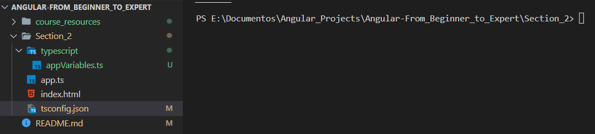


## 2.5 String templates
- El uso de backtics (**``**) permite usar string templates para que la concatenación de strings no sea tan engorrosa. Permite que todo lo que esté entre los backtics se procese como un string sin necesidad de poner caracteres especiales con el \n para el salto de línea, pero también los permite. También permite añadir lógica en la template, es decir todo lo que esté entre **{}** se considera código JS. Comprando el TS con el JS se puede ver que la mejora a la hora de trabajar con string es evidente
 


## 2.6 Functions: Mandatory, Optional and Default parameters
- Es muy importante espeficicar el tipo de dato en los parámetros de una función al definirla. Normalmente el orden de definir los parámetros de una función es obligatorios, opcionales y por defecto.
  - Parámetro obligatorio: Se indica el nombre seguido de **:** y el tipo
  - Parámetro opcional: Se indica como un obligatorio pero el nombre del parámetro concatenado con **?**
  - Parámetro con valor por defecto: Se indica como un obligatorio seguido de **=** igual al valor por defecto

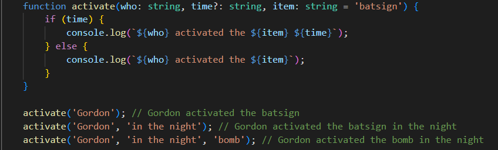

## 2.7 Arrow functions
- Definir una función como una variable de tipo constante me permite que no pueda ser modificada, es una buena práctica.
- Las funciones flecha fueron incluidas en ES6
- Las funciones flecha tienen la ventaja de que si sólo tiene una línea con return, se puede omitir poner las llaves de la función **{}** y el propio **return**.


- Las funciones flecha pueden solventar el problema del scope de las funciones tradicionales, es decir, el **this** cambia. Con las funciones arrow no se cambia el scope.


## 2.8 Destructure objetcs and arrays
- Es posible extraer partes de un objeto o de un array de manera simple.
- Para extraer sólo algunos campos de un objeto se usan **{}** y se pueden guardar directamente en variables. Para ello los nombres de las variables deben coincidir con el nombre del campo, pero da igual el orden de extracción.


- Es posible usar la extracción directamente en la definición de una función (en la imagen se marca como error porque no se especifica el tipo)


- Para extraer sólo algunos elementos de un array se usan **[]** y se pueden guardar directamente en variables. Para ellos los nombres de las variables pueden ser los que se quiera, pero aquí si que hay que respetar el orden. Si sólo se quiere extraer un elemento, habrá que seguir respentando el orden. Al igual que antes, también es posible usar la extracción directamente en una función (en la imagen no se marca como error porque aquí si se especifica el tipo)


## 2.9 Promises
- Las promesas principialmente permiten tener una gestión sobre la respuesta de llamadas asíncronas y fueron introducidas en ES6. Cuando se requiere trabajar con respuestas de llamadas asíncronas el código se llena de callbacks, que se ejecutan (normalmente) cuando la llamada asíncrona en cuestión responde. Las promesas, ayudan a que el código no esté cargado de callbacks y que cuando se requiera utilizar los datos de una llamada asíncrona, saber si ese datos está ya disponible o no.

- Al crear la promesa se le debe pasar función cuyo dos argumentos sean dos funciones, **resolve** y **reject**. El resolve se devuelve cuando todo funciona correctamente y el reject cuando algo falla.
  
- La promesa tiene dos funciones, **then** y **catch**. Usamos then cuando todo ha ido bien y catch cuando falla algo. Y se recibe lo que se pase como parametro en el resolve o el reject. El no manejar errores en las promesas pueden detener el flujo del programa como se ve en una de las siguientes imágenes.


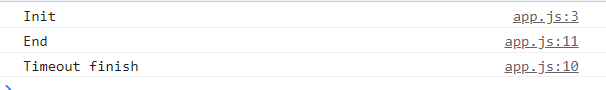


- Hay que definir qué hacer en caso de que la promesa se resuelva bien y también mal.


- En el ejemplo si se juega con el delay del timout se podrá verifica que sólo se ejecuta una de las funciones que se le pasa a la promesa, la que llegue antes.


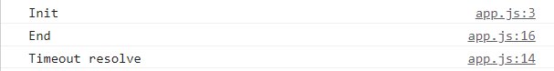


- Se puede simular la llamada a una función que retorne una promesa, esta se encargaría de solicitar a un servicio que hiciera algo (retirada de dinero en este caso) e implementar que hacer en caso de que la promesa se resuelva o falle. Además gracias a las función flecha puede quedar muy simple.

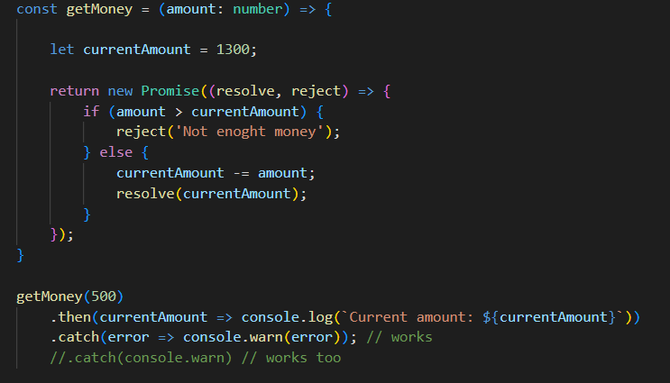
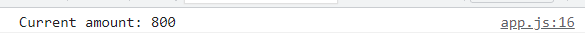
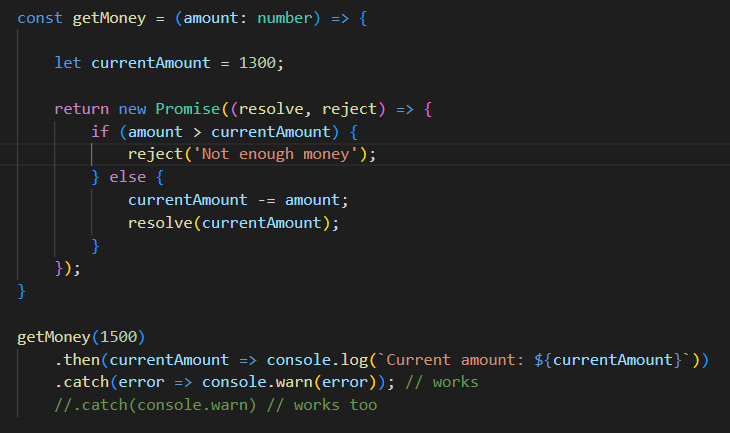


- Ahora mismo no hay control sobre el tipo de datos que devuelve la promesa, se indica que es desconocido (**unknown**). Para especificar esto en la función getMoney hay que definir el tipo de dato que se va a devolver, en este caso una promesa que si se resuelve será un number.


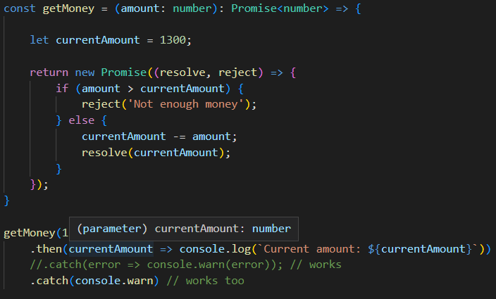

## 2.10 Intefaces
- Cuando se quiere acceder a propiedades de un objeto, no se puede estar seguro sin hacer una validación previa, que el objeto contenga dicha propiedad. Se podría indicar en una llamda que se manda un objeto y sus campos indicando el tipo de cada uno. De este modo si se intenta usar la función con un objeto que no cumpla al menos con los campos que se necesitan, se marcará error. Pero no es la mejor manera.


- Para tener un código robusto y además poder darle una entidad a los objetos, en TS se usan interfaces. Basicamente es poner reglas para asegurarse de cumplirlas. No existe una interpretación de interface TS en JS. Para definir las interfaces se usa la palabra reservada **interface**. En la siguiente imágen se puede ver como tras definir la interface TS nos avisa que no se está asignando una propiedad que posea la interfaz definida.

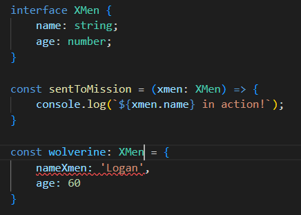

- Si por alguna razón en el futuro hay que cambiar el nombre de una propiedad, TS avisaría de todos los lugares donde se está usando.


- También puede ocurrir que se le añada una propiedad a la interfaz, esto maracará error en la creación del objeto de ese tipo. Pero se puede indicar que una propiedad sea opcional concatenando **?** al nombre del campo. En la siguiente imagen se puede ver como TS indica que faltan dos de las tres nueas propiedades, esto es porque una de ellas es opcional.

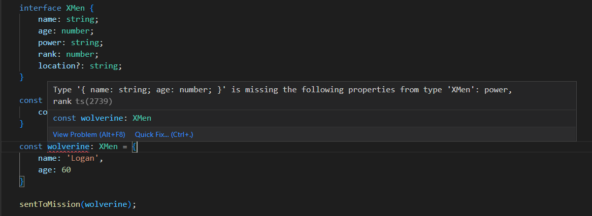

## 2.11 Clases en TS
- Las clases son soportadas en ES6. Las clases, en TS, se usan para definir tipos de datos que además pueden ejecutar ciertos métodos. Para definir una clase se usa la palabra reservada **class**. Aunque añadamos muchas propiedades en TS, hasta que estas no se inicializan, JS no las crea.

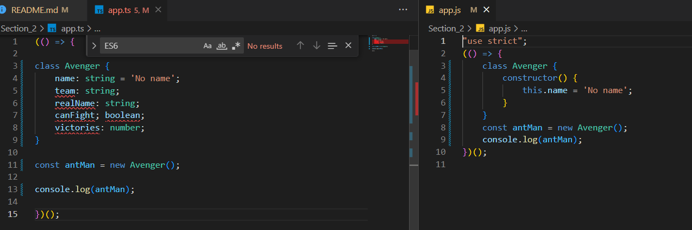

- Para inicializar los campos de la clase se puede hacer directamente en la declaración del campo pero es buena práctica hacerlo en el constructor ya que es posible necesitar ciertos valores para inicializar los campos. El constructor es una función que todas las clases tienen y que se invoca siempre que un objeto de esa clase es instanciado / creado. Se usa la palabra reservada **constructor**.

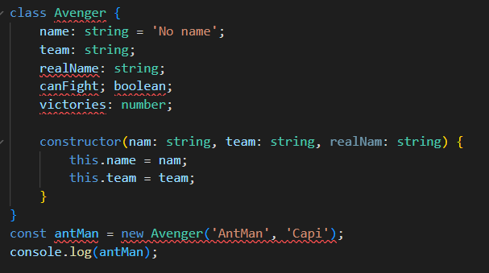

- En el constructor hay que tener el cuenta la visibilidad **public**, **private** o ninguna, como se ha visto hasta ahora, que se le da a una varible en el constructor, ya que si es **public** se creará como otro campo más de la clase y a su vez se inicializará con el valor que pasemos (por ello se suele usar para inyectar servicios), por ello no puede llamarse igual que un campo ya existente, y podrá ser accedida tanto desde dentro como desde fuera de la clase. Si es **private** pasará lo mismo que con public, con la única diferencia que este nuevo campo no podrá ser accedido desde fuera de la clase, será interno.


- Por lo que se usa el constructor no sólo para hacer lógica necesaria para inicializar el objeto, sino para crear campos de la propia clase. Indicando que algunas propiedades son opcionales, la instanciación del objeto no marcará error, pero se crearán las propieades igualmente.


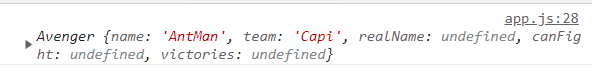


- También se puede usar lo visto anteriormente en relación a parámetros por defecto, para así, en el caso de no informar una propiedad inicializarla a un valor.

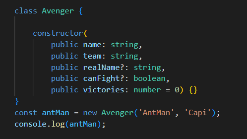


## 2.12 Imports
- Aquí se va a ver cómo importar módulos. Este es algo que Angular ya hará de manera automática. En los recursos del curso hay una URL hacia GitHub de donde descargar un repositorio que servirá de base para estudia las importaciones. Este enlace lleva a un repositorio público de Fernando Herrera, creador del curso (https://github.com/Klerith/webpack-starter-typescript). Descargar el código como zip, descompirmirlo y renombrarlo como typescript-importer. Es un projecto TS por lo que se deberá trabajar con él en una carpeta diferente a la que hemos estado trabajando, ya que tendrá su propio tsconfig.json.
  
- Dentro de la carpeta del proyecto, desde una terminal, ejecutar **npm install**, esto instalará los módulos de dependecias descritos en el package.json. Después de la instalación aparecerá una carpeta nueva "node_modules" que es dónde se instalan las dependencias del proyecto.


- Para arrancar la aplicación se usa **npm start**. Lo que hace este "start" viene definido en el package.json, que en este caso, ejecuta **webpack-dev-server --open --port=8080**, es decir, arranca la apliación en el webpack (servidor), puerto 8080 y abre el navegador. Probablemente obtengas un error al intetar ejecutar este comando ya que este curso tiene ya algunos años y la versiones más modernas de Node son incompatibles con este webpack.He podido solventar el problema abriendo una consola de CMD (Windows) y añadiendo la siguente variable de entorno NODE_OPTIONS con el valor que se ve en la imagen. Y después ejecutando el **npm start**, pero todo ello desde el CMD y no desde la Terminal PS que abre mi IDE. Es posible que más adelante, en este curso, haya que borrar esta variable de entorno debido a que se ha añadido por la particularidad de esta sección y por ahora desconozco si generará algún conflicto con proyectos Angular.


```
set NODE_OPTIONS=--openssl-legacy-provider
```

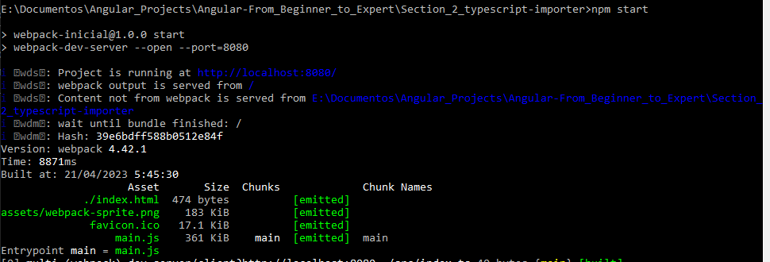

- Una de las cosas buenas de trabajar con webpack es que cada vez que hacemos un cambio, actualiza automáticamente la pantalla.
  
- Esta sección se centra en las importaciones, para ello, vamos a ver como importar una clase. Crear un fichero donde definir una clase y anteponer la plabra reservada **export** para poder usarla en otros ficheros, sin poner el export sólo se podría usar en su propio fichero (privada). En el index.ts usar esta clase (sin importarla aún), TS marcará un error


- Para importar una clase no sólo es necesario que esta esté definida con el **export**, sino que dónde se quiera usar habrá que incar que la importamos, para ello se usa **import {...} from '...'**, dónde entre las {} se indica el nombre de la clase y tras el from la ruta dónde está definida. En la siguiente imagen se puede ver cómo ahora sí que reconoce la clase y TS nos indica que hay que añadir dos argumentos al constructor. Si se añaden métodos u otras propiedades, TS las reconoce y nos facilita la impmentación


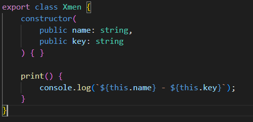

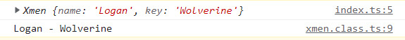

- Hay más maneras de hacer importaciones, pero esta es la más común, el resto se irán viendo durante el curso según se necesiten.

## 2.13 Classes decorators
- Un decorador es una anotación (como en Java Spring) que se coloca antes de la clase y sirve para añadir funcionalidades / propiedades a la clase, como que es un componente, un servicio, etc, es decir, expande la clase. Para poder usarlos hay que inicar al TS que los habilite, para ello en el tsconfig.json descomentar la propiedad "experimentalDecorators" que está a true.


- Para que TS tome correctamente los cambios, habría que parar la aplicación y volver a levantarla, así el navegador ya no mostrará el error relacionado con los decoradores.

- Añadiendo una función y poniendola en el decorador, se puede ver en el navegador como se ejecuta el código de la función añadida en el decorador cuando se crea la clase.


- Angular hará las importaciones / decoraciones automáticamente. El fin de este curso no es crear decoradores, si no usar los que Angular ya provee, y este punto de la sección está para entender qué hacen.

## 2.14 Function return type
- Hasta ahora no se había especificado el tipo de dato que devuelve una función, aunque TS si que lo reconoce, como en el siguiente ejemplo de una función que suman dos números (sabe que devuelve un número), por lo que podríamos ahorrarnos el especificar el tipo. Para específicar hay que indicarlo usando los **:** justo después de la declaración de argumentos de la función. Esto se hace para evitar errores y devolver algo que no se quiera, como se dijo anteriormente, es poner reglas para asegurarse cumplirlas.


- Pero, hay ocasiones en las que TS no es capaz de reconocer el tipo de dato que se devuelve. Eso es lo que pasa si se devuelve por ejemplo una promesa, que no se sabe de qué tipo es. Y portanto no se podría tener un buen control sobre el dato duvelto cuando se resuelva / rechace.

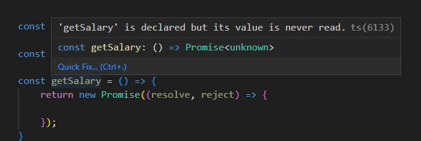

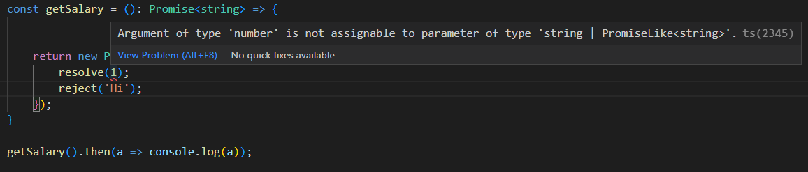

# Section 3 WebApp: Hello World
En esta sección se va a realiar las primera aplicación Angular ("Hello World"). También se explicarán conceptos clave de Angular y se empezará a utilizar algunas instrucciones.

## Introduction to Components and Directives
- Las aplicaciones de Angular están basadas en múltiples componentes. Un componente es una pequeña clase que cumple una tarea específica. Contiene su propia lógica(TS), estructura (HTML) y estilo (CSS). Se aisla del resto de componentes, esto permite que sea reutilizable.
- Las directivas estructurales son instrucciones que indican a la parte del HTML qué tiene que hacer. Dos directivas de las más utilizadas son **\*ngIf** y **\*ngFor**. La primera se suele utilizar para pintar o no elementos del HTML y la segunda para construir elementos a partir de iterar objetos / arrays.
- Hay dos webs que son de gran ayuda a la hora de trabajar con Angular, una es su propia web https://angular.io/, donde encontrar toda la información sobre el framework. Y otra es un servicio que es un IDE en linea para probar rápidamente código con varios tipos de framworks, https://stackblitz.com/. En este servicio si pulsamos sobre la opción de Angular, arranca automaticament una aplicación ejemplo en Angular, dónde se puede ver la composición del proyecto, código y resultado.

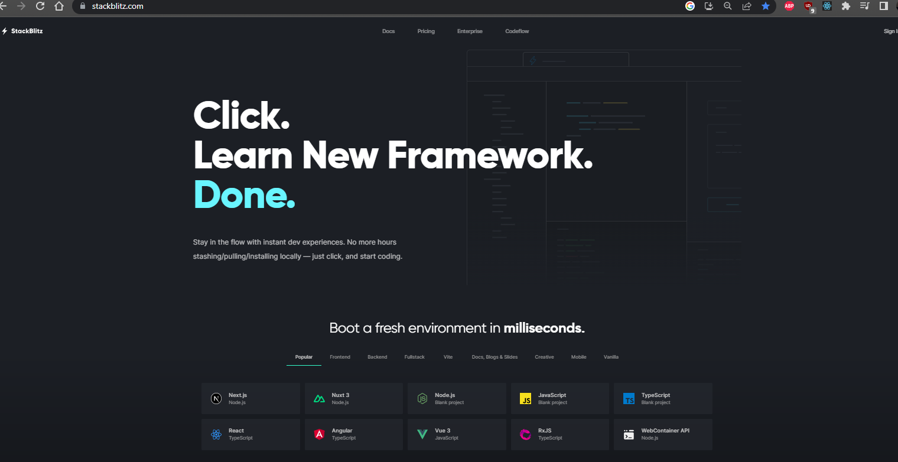


- En el ejemplo de Stackblitz se puede ver varias cosas en relación a los componentes. En el index.html que es el HTML que se carga al inicio se usa una tag llamada **my-app**, esta tag no es de HTML, sino que es la tag que indica que se pinte el componente cuyo selector es el nombre de la tag. Si se mira el main.ts, aquí se declarar un componente (con el decorador @Component) cuya propiedad **selector** es 'my-app', por lo que será este componente el que se pinte en el index.html. Este ejemplo es un caso particular ya que el componente también posee la propiedad **template** que indica como se ha de pintar el componente, pero lo normal es tener esto en un fichero separado del TS del componente. En el HTML de un componente se puede acceder a las propiedades del mismo con llaves dobles **{{}}**, se denomina **interpolación**. De hecho, en Angular cuando se usan las llaves dobles se puede ejecutar lógica cómo se fuese un JS.


## Components
- Es una clase extendida, es decir, con más funcionalidades.
- Para crear un componente se usa la instrución de Angunar **ng g c nombreDelComponente** desde un terminal / consola de comandos (AngularCLI). Esto cerará por defecto 4 ficheros y actualizará el app.module.ts añadiendo el nuevo componente a los declarados (**declarations**).
  - HTML: Estructura del componente.
  - CSS: Estilo del componente.
  - TS: Lógica del componente
  - SPEC.TS: Para testing del componente
- Usa el decorador **@Component** que es importado del módulo **Component** en **@angular/core**.
- Propiedades relevantes:
  - selector: Indica el nombre de la tag para usar el componente dentro de un HTML
  - template: Estructura HTML del componente. Se usa cuando el HTML del componente es simple (1 o 2 líneas)
  - templateUrl: Ruta donde se encuentra el HTML que tiene la estructura del componente
  - styleUrls: Array de rutas de los CSS que usa el componente.


## Creating the WebApp
- Para crear una aplicación Angular (sirivendonos de AngularCLI) se usa el comando **ng new nombreDeLaApp**. Si en la generación de la aplicación pregunta si usar routing, contestar no, y en el tipo de estilo a usar, contestar CSS.

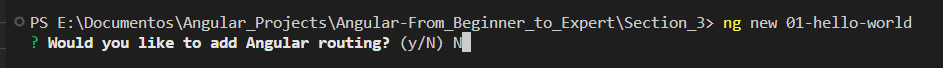


- Se instalarán todos los paquetes necesarios para crear la aplicación. Una vez instalados, en la terminal que se usa para los comandos se debe estar dentro de la carpeta creada para el proyecto, si no, no se reconocerán los comandos ng para trabajar en la aplicación.

- Para arrancar la aplicación, usar el comando **ng serve**. Esto levanta un servidor local en el purto 4200 por defect. Si después del comando se añade el atributo **-p** se puede cambiar el puerto, si se añade el atributo **-o**, abrirá directamente el navegador con la aplicación.


- Tras crear la aplicación y levantarla, siempre que se haga un cambio en ella que necesite renderizarse, esto se hará de manera automática.

- En la carpeta *src > app* es dónde se crea el componente principal de la aplicación, por así decirlo, el "componente aplicación". Si se modifica su app.component.html se verá como lo que renderiza la aplicación cambia.


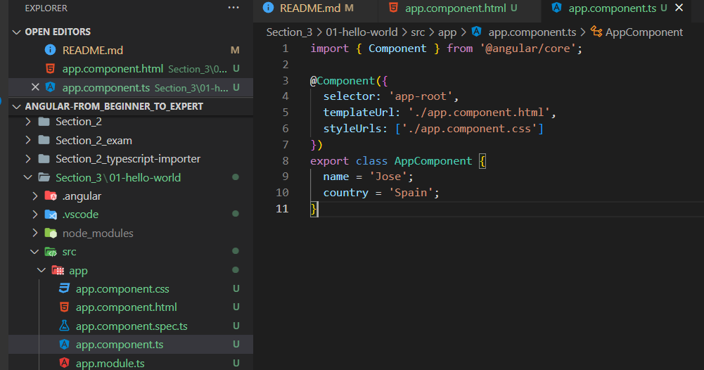


## Project Structure
- <u>**e2e**</u> folder: En versiones antiguas de Angular, esta carpeta es la destinada al manejo de pruebas end to end, en este curso no se trabaja con ella. Usada para pruebas unitarias y de integración (se puede abordar en otro curso de **Fernando Herrera**)
- <u>**node_modules**</u> folder: Contiene los paquetes instalados al crear la aplicación, es decir, los módulos necesarios con el fin de desarrollo, cuando se cree la versión de producción de la aplicación no se incluye esta carpeta. Todos los módulos de Node están declarados (en el package.json) y si por algún caso se borrar la carpeta, haciendo **npm install** se volverían a instalar
- <u>**src**</u> folder: Es donde está la aplicación. Está compuesta por varias carpetas y ficheros.
  - **app** folder: Contiene el primer componente de Angular en la aplicación que se va a cargar. Dentro de ella están los diferente archivos de este componente: CSS que determina el estilo del componente, HTML que determina la estructura del componente, el SPEC que se usa para pruebas unitarias y el TS que indica el comportamiento del componente. El app.module.ts posee un decorador @NgModule que sirve para indicar que es un módulo y los componentes que posee.
  - **assets** folder: Dónde se colocan los archivos estáticos. Contiene el fichero **.gitkeep** que lo único que sirve es para que git siempre tenga en cuenta la carpeta assets, aunque esté vacía (no la ignore).
  - **index.html**: Es el index de la aplicación y de hecho invoca al app component para que sea renderizado (tag **\<app-root>**).
  - **main.ts**: Contiene el código que se va a lanzar primero al ejecutar la aplicación. Contiene una función (**platformBrowserDynamic**) para preparar el entorno para el tipo de aplicación que se va a ejecutar. Esto al crear aplicaciones para otros entornos, moviles por ejemplo, cambia un poco.
  - **styles.css**: Fichero de estilos globales de la aplicación.
- <u>**.editorconfig**</u>: Contiene configuraciones del editor.
- <u>**.gitignoer**</u>: Fichero que indica al repositorio de git que tipo de ficheros / carpetas debe ignorar para el vesionado.
- <u>**angular.json**</u>: Fichero que le indica a Angular como es nuestra aplicación y como funciona. En este arhivo basicamente se modifican tres cosas: asstes, styles y scripts.
- <u>**package-log.json**</u>: Fichero que indica al Node como fue creado el package.json. Este archivo se modifica de manera automática, no se toca manualmente.
- <u>**package.json**</u>: Este fichero es muy importante ya que contiene información de la aplicación y dependencias. Se va creando de  manera automatica según vamos trabajando en la aplicación.
- <u>**README.md**</u>: Fichero que se crea automáticamente y explica como funciona la aplicación.
- <u>**tsconfig.json**</u>: Indica a TS cómo trabajar.


## Using Boostrap in first component
- Para al primera aplicación se va a usar la librería bootsrap (https://getbootstrap.com/) para aplicar un CSS atractivo para la misma. Para ello no se va a instalar ninguna dependencia de bootsrap, sino que directamente se usará la librería (fichero) que tienen publicado importándolo es la aplicación vía CDN. Se añade al index.html de la aplicación.


- Este primer componente se creará de manera manual (no mediante el comando del AngularCLI), para así entender mejor como funciona Angular. La estructura que se suele seguir es crear una carpeta **components** dentro de **app** para almacenar todos los componentes y dentro de esta una carpeta por cada componente. Empezaremos por el "header". Dentro de la carpeta header es dónde se añadirán los archivos del componente.
  - header.component.ts: Para la lógica del componente.
  - header.component.html: Para la estructura visual del componente.
  - header.component.css: Para el estilo visual del component.
  - header.component.spec.ts: Para testear el componente.

- Hay que recordar que si la clase del componente no se exporta, no se podrá  importar y añadir a **declarations** en el app.module.ts y por tanto no se podrá usar en la aplicación con su selector.

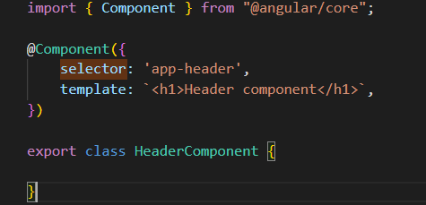

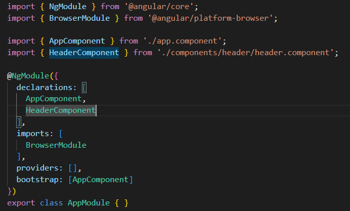


- Ahora se va a hacer uso de bootstrap para darle un aspecto más atractivo a la aplicación, para ello se usará el *navbar* en un nuevo fichero que se llamarán header.component.html ya que la cantidad de código es mucho mayor al aconsejable poner en la propiedad **template**. Este será el que usará el componente, por lo que hay que referenciarlo en su TS, en la propiedad **templateUrl**.

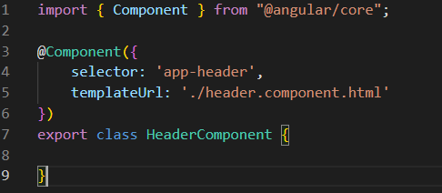


- Se puede crear otro componente "body" dentro de la carpeta "app > components" para usarse después del "header", este debe tener su TS y su HTML, además deberá ser declarado en el app.module.tos, quedando de la siguiente manera:


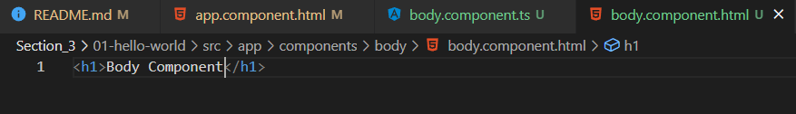

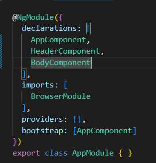


- Habiendo visto lo tediso que es crear componentes de manera manual, es el momento de crearlos usando AngularCLI con el comando **ng g c nombreDelComponente** dentro de la carpeta del proyecto / aplicación Angular. Con el compando crear el "footer", creará 4 archivos y actualizará automaticamente el app.module.ts declarando el nuevo component.


- Para aplicar estilos globales de la aplicación se usa el style.css que cuelga directamente de la carpeta "src", está al mismo nivel que la carpeta "app".


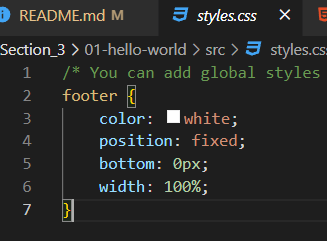

- El siguiente paso es empezar a implementar el "body". Para ello se usará las *cards* y *lists* de bootstrap, además de modificar algo el css para que el aspecto de la aplicación quede mejor. Dejando de la siguiente manera los HTML's el aspecto de la página mejor mucho. Ya sólo quedaría aplicar directivas de Angular.

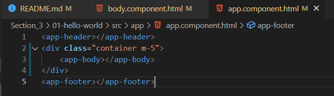

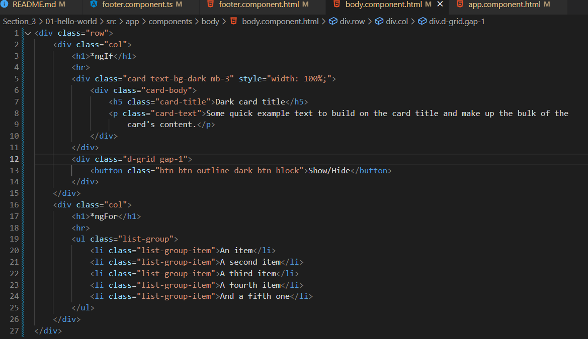

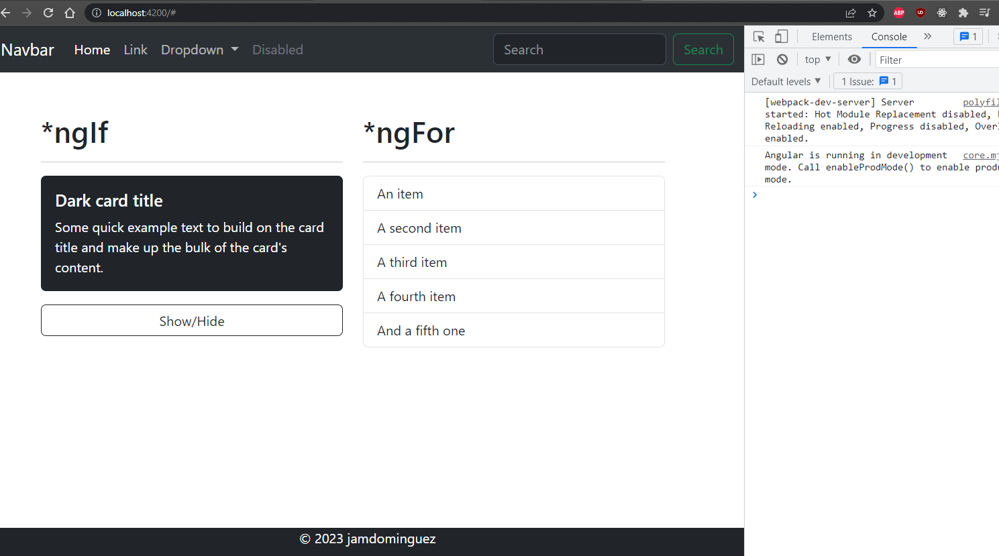

## Directives: *ngInf and *ngFor
- Las directivas estrucutrales son instrucciones que agregan, eliminan o reemplazan elementos HTML en la template.
- La directiva estructural *gnIf se suele utilizar para mostrar / ocultar algo del componente. Para ello se usa la directiva en el elemento que se desea mostrar / ocultar. Si la directiva es igual a true, mostrará en elemento, si es igual a false, lo ocultará. Hay que tener en cuenta que usando esta directiva, Angular lo que hace es destruir / recrear el objeto (no ocultarlo / mostarlo.). En el ejemplo, con el botón se puede cambiar el valor de la variable usada para mostrar u ocultar la zona de información. La directiva quedaría como **\*ngIf="showElement"**

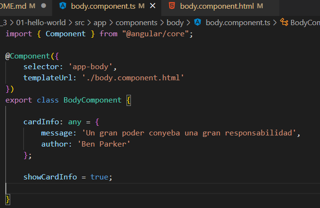


- La directiva estructural *ngFor se usa pintar un mismo elemento / bloque de código varias veces con diferente información, normalmete recorriendo un array. La directiva quedaría como **\*ngFor="let element of list"**, pudiendo usar element para obetner la información. Dentro del *ngFor se puede acceder al indice (**index**) de la iteración que se está realizando.


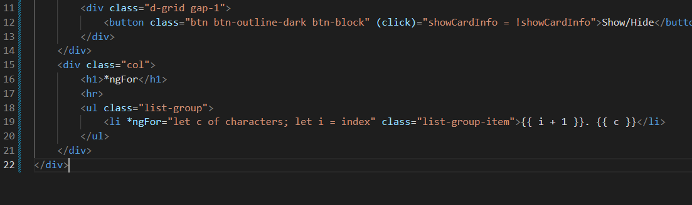

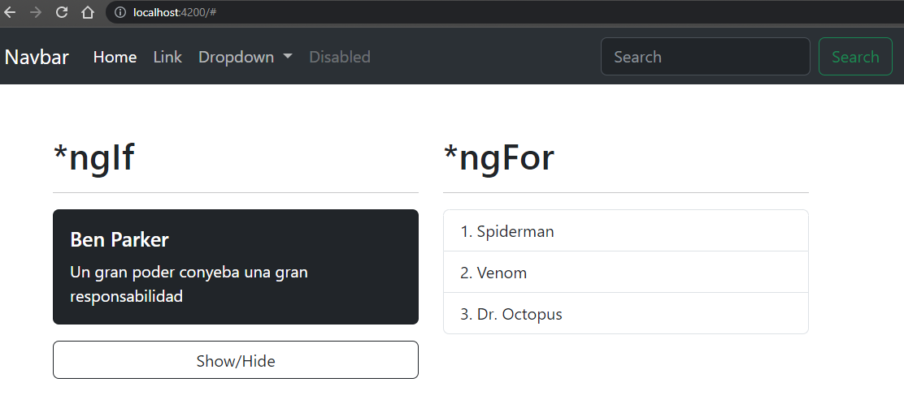


# Section 4: SPA
- Una Single Page Application, es una WebApp que usa ruta, servicios, buscadores y que refresca sólo sus componentes sin tener que refrescar el navegador.
- De los recursos adjuntos en la sección para la realización de la WebApp, destacar el animate.css que contiene animaciones en CSS3 que harán la aplicación más atractiva y el data.txt que contiene información que mostrar en la aplicación.
- Crear la aplicación spa con **ng new spa** y renombrar la carpeta a 02-spa. Cuando en la creación se pregunta si crear routing, responder N.
- Para esta aplicación se generarán componentes compartidos, para ello, crear la carpeta app > components > shared, y dentro de ella el primer componente navbar con **ng g c components/shared/navbar**. Para este componente no necesitaremos ni su propio CSS ni su fichero de testing (SPEC.TS), por lo que se pueden eliminar. Recordar eliminar la referencia en el componente en la propiedad **stylesUrl**.

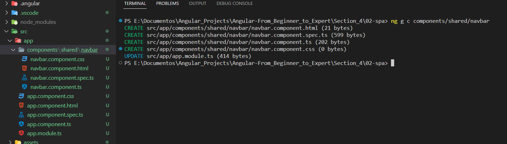

- El siguiente componente a crear podría ser el home, usando el mismo comando visto, pero esta vez dentro de la carpeta components pero no de la shared. Aquí tampoco se van a usar su CSS ni su fichero de testing, por lo que también se pueden elminar.
- Si por alguna razón se crea un componente de manera errónea, es decir, se crea en un sitio que no queremos, o nos equivocamos en el nombre, etc, AngularCLI tiene un comando para eliminarlo, pero es posible hacerlo a mano, borrando su carpeta y posteriormente actualizando el app.module.ts, que es donde se declaran los componentes de la aplicación. También se puede modificar a mano, pero habrá que actualizar también el app.module.ts con los cambios hechos.

## Libraries from 3rd parties (Bootstrap)
- Existen 3 maneras de instalar bootstrap en la aplicación:
  - Linkando la dirección CDN en https://getbootstrap.com/docs/5.3/getting-started/download/. Esta fue la manera usanda en la primera y es aplicación del curso. Es la aconsejada si se trata de una aplicación Web, ya que requerirá internet para cargar la librería, además puede que el usuario ya tenga cacheada la referencia a la librería de haber estado navegando por otras páginas. Lo que se hace es copiar el código de la página de bootstrap y pegarlo en el index.html de nuestra aplicación. Recordad que los links se colocan al principio del HTML y los scripts al final.

  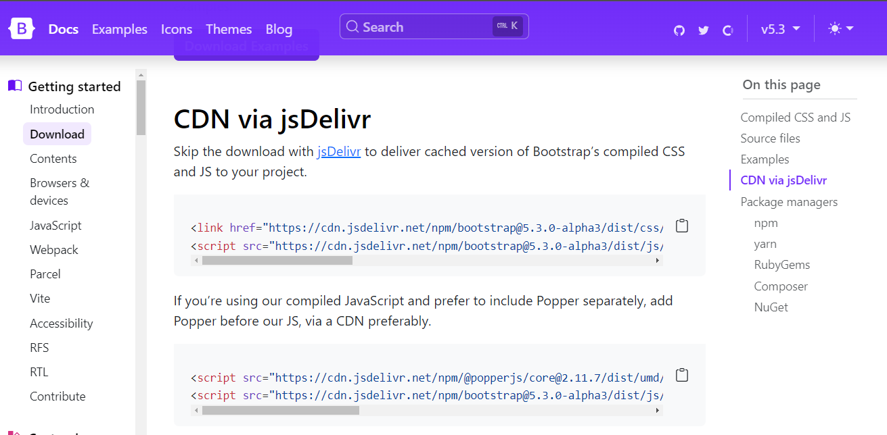

  - Descargando la librería en https://getbootstrap.com/docs/5.3/getting-started/download/. Se puede descargar la versión distribuida, copiar y pegar en el proyecto las carpetas CSS y JS. Así para utilizar bootstrap de este modo cuando se haga referencia a los ficheros habrá que indicar la ruta de donde se ha colocado dentro del proyecto. Esta manera tiene la ventaja de que no es necesaria conexión a internet, ya que la aplicación contiene ya las librerías. Normalmente, las librerías de externos, se suelen guardar en "src > assets > libs > nombreDeLalibreria".

  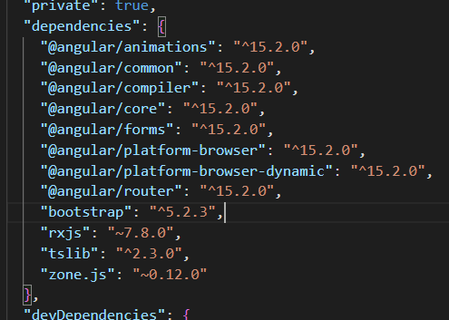

  - La última manera es instalando la dependencia de bootstrap usando npm, con la instrucción **npm install** como indica la página de bootstrap https://getbootstrap.com/docs/5.3/getting-started/download/. Añadiendo el atributo **--save** a la instalación le indicamos a Angular que esta va a ser una librería que va a necesitar. Una vez instalado se puede comprobar que se ha añadido a la carpeta "node_modules". Así se isntala la última versión estable, se puede ver añadida al package.json del proyecto. En el curso, con la versión 4.1 de Bootstrap era necesario instalar jquery y popper.js ya que se informaban en unos warnings, pero a mi me ha instalado la versión 5.2 y no ha aparecido ningún warning, por lo que entiendo que esta dependencia ya no existe. Lo ultimo sería añandir en el angular.json el estilo de la aplicación, que en nuestro caso será aplicado por la librería Bootstrap. Esto se hace añadiendo esta información en los campos **styles** y **scripts**, así AngularCLI sabrá como funciona la aplicación. Después de esto es necesario parar la aplicación y volver a levantarla. Esta última manera hace que todas las librerías formen parte del bundle, y puede hacer que la librería pese un poco más.

  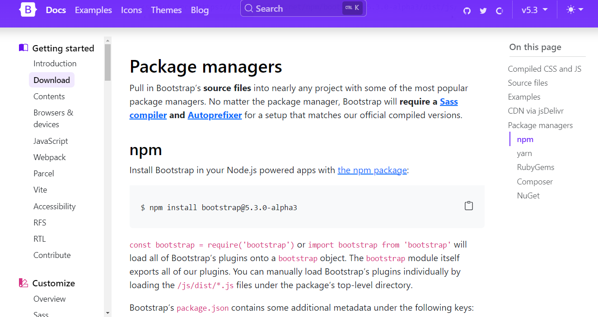

  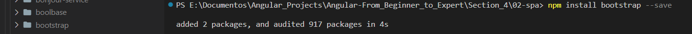

  

  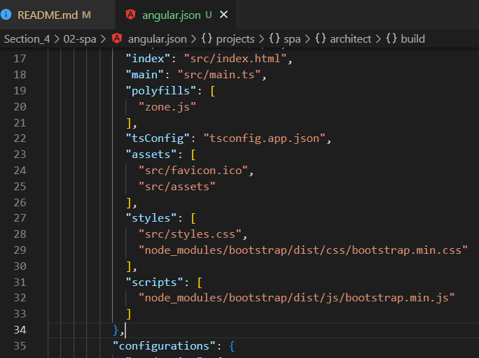

- Si tras aplicar alguna de estas maneras para añadir bootstrap a la aplicación y volver arrancarla, se comrprueba que el estilo ha cambiado (aunque sea minimamente) y no hay errores en la terminal o en la consola del navegador, es que se ha hecho bien.
  
## Components configuration
- Lo primero es copiarse todos los recursos descargados a la carpeta "assets > imgs" del proyecto.
- El favicon.ico reemplazarlo por el de los recursos de la sección.
- Para el componente navbar usar el código de navbar de bootstrap https://getbootstrap.com/docs/5.3/components/navbar/#how-it-works
- Para el componente home usar el código de jumbotron de bootstrap https://getbootstrap.com/docs/5.3/examples/jumbotron/
- En este punto hay que añadir 2 nuevos componentes, uno para los "heroes" y otro para el "about"

## Routing
- Las rutas permiten navegar entre componentes / paginas de nuestra WebApp sin necesidad de hacer refresh del navegador. Si se creo el proyecto sin routing, habrá que crear el fichero donde configurar las rutas, si por el contrario se creo con routing, este fichero ya existirá y sólo habrá que ir actualizandolo. El fichero se encuentra al mismo nivel que el app.module.ts. Existe una convención para que este archivo se llame **app.routes.ts**. Con la extensión Angular 10 Snippets (en mi caso) tendremos sugerencias para crear este módulo de rutas en Angular. Cuando el curso se creó, el componente de rutas se creaba con ng2-routes, pero parece que esto ya no existe en mi versión (15), y ahora se usa **ng-router-appmodule**. Al fichero de rutas también se le suele llamar **app-routing.module.ts**.

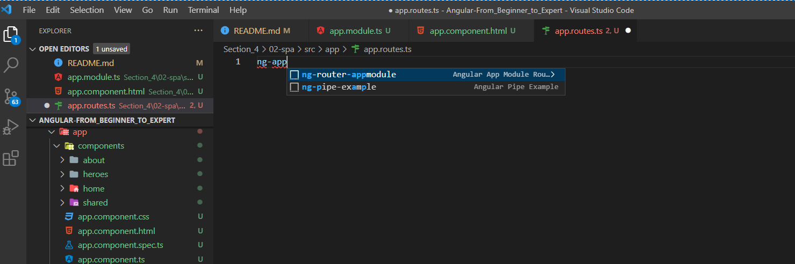

- Una vez creado el contenido del fichero, hay que crear las diferentes rutas de la aplicación. Por ahora con definir la ruta del home y del about es suficiente. Al forRoot es recomendable usar el hash con **{useHash: true}** para evitar problemas en el envío de parámetros. Por otro lado en el index.html se indica **base href="/"**, si esto se quita / comenta y no se usan rutas, la aplicación va a dar error (No base href set).

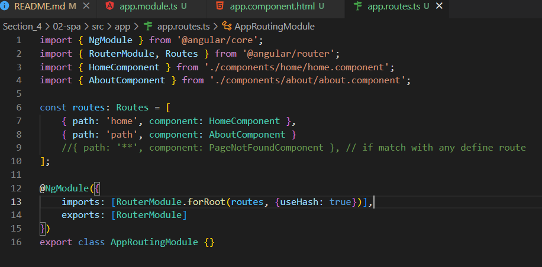

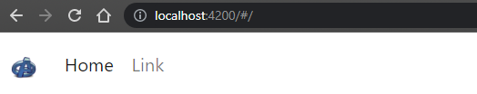

- Una cosa muy importante, si no, no se podrán usar las rutas, es ten el app.module.ts indicar que se va a importar el sitema / módulo de rutas. Para ello en el campo **imports** añadir el **AppRoutingModule**. En el curso se hace algo diferente ya que la versión de Angular es más antigua y esto ha cambiado en la versión que yo uso (15)

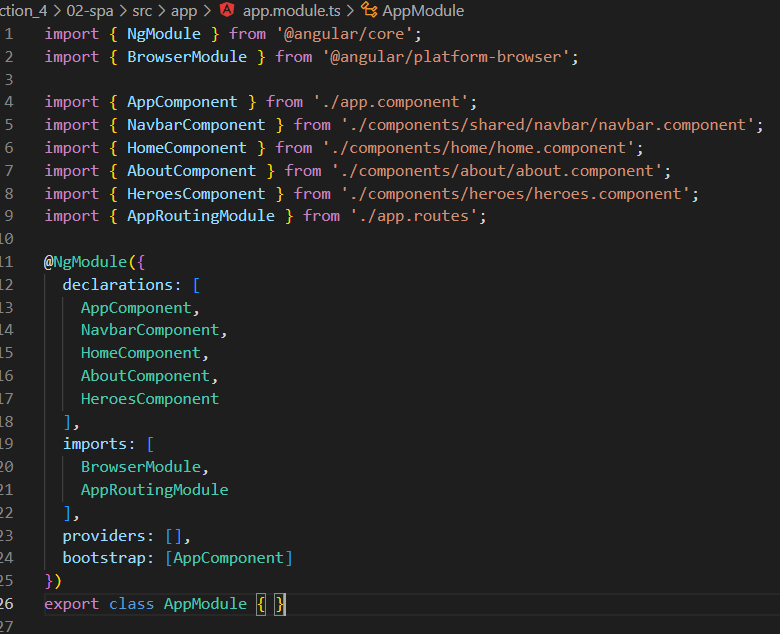

- En el app.component.html con el selector **router-outlet** es como indicamos que ese ahí se renderizará un componente según la ruta.

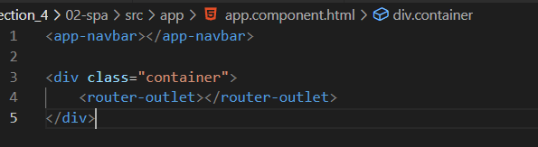

- Terminar de añadir las rutas e indicar que para un path no definido que redireccione a lo mismo que hace la ruta home.
- Ahora se va a añadir **routerLink** en los elementos del navbar con los que queremos hacer que se navegue. A estas directivas de Angular se les asigna un array, donde cada posición del array es un segmento del path que va a cargar y por tanto su componente asociado y definido en el app.routes.ts.

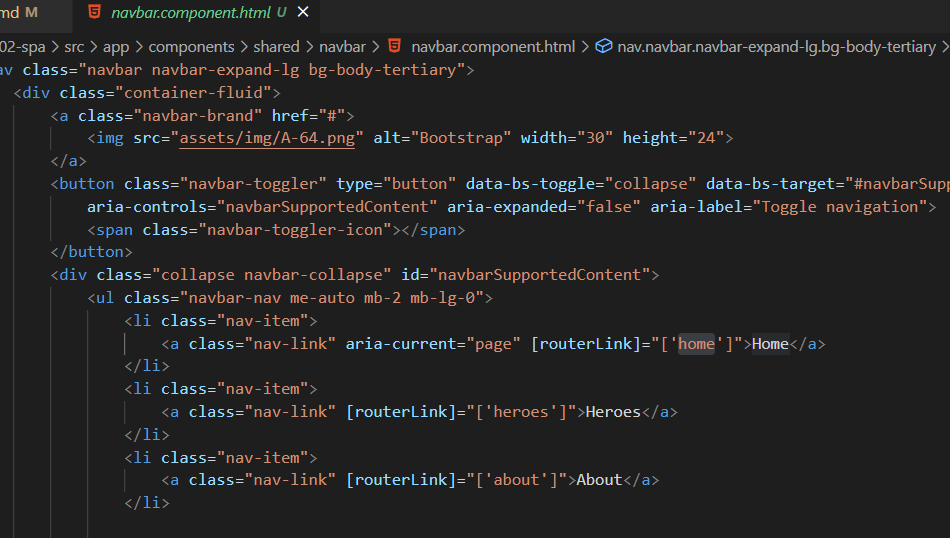

- Para mejorar la transición entre componentes se puede incluir el animate.css de los recursos de la sección. El contenido de este fichero se puede pegar en el style.css de la aplicación.
- Por último en relación a las rutas es hacer que el estilo del navbar se actualice según ruta seleccionada. Se debe a que no se le está colocando la clase active al elemento. Esto se puede hacer usando el **routerLinkActive** en cada "a" del "navbar" e igualándolo a la clase que se quiere aplicar cuando se seleccione la ruta.


## Heroes Component
- Para montar este componente se va a usar las "cards" de Bootstrap en https://getbootstrap.com/docs/5.3/components/card/#about


- La información para rellenar este componente debe ser proveida por un servicio, es estandar y buena práctica.

## Heroes Service
- La idea de los servicios es aislas los datos de los componentes y que estos sólo se encarguen de pintar cosas y si tienen que hacer alguan lógica es en referencia a los datos que tratan, no a obtener datos, estos deben ser proveidos por un servicio. Así, si otro componente necesita los mismos datos que el anterior, puede usar este servicio también.
- Los servicios:
  - Proveen información a quien lo necesite
  - Realizan peticiones CRUD
  - Persistencia de datos
  - Recurso reutilizable
- AngularCLI permite crear servicios con la instrucción **ng g s nombreDelServicio**. Se suelen organizar dentro de una carpeta "app > services"


- Una vez creado, se puede inyectar en el componente que se quiera usar. Para ello, en el constructor del componente añadir un argumento privado del tipo del servicio. En nuestro caso, en el componente heroes. Cuando se inyecta un servicio, sólo se hace una vez y aunque se vuelva a llamar al componente, no se vuelve a crear el servicio. Es decir, ya queda inyectado en el momento que se crea el primer componente que lo use (como un singleton de Java).


- En el curso indica que los servicios hay que declararlos en el app.module.ts en la propieda **providers**, pero el lo crea de manera manual, sin comando y a mi no se me ha actualizado, pudiendo usarlo / inyectarlo correctamente en el componente. Así parece que ya no hace falta dicha declaración.
- Para rellenar de información el servicio, se usarán los datos del fichero data.txt proporcionado en los recursos del curso y se puede añadir como array dentro del servicio. Con una función pública el servicio puede proveer dicha información y usar dicha función en el heroes component.


- El sitio adecuado donde hacer una llamada a un servicio y guardar su valor en un campo de un componente es el ngOnInit. Aquí es dónde se debería hacer y ya con los datos crear el contenido del componente.


- Con toda la información proporcionada por el servicio se puede construir el componente heroes usando la directiv *ngFor.


- Una ultima cosa para dejar bien el código sería que el array de heroes no fuese de tipo any, sino que fuese del tipo Heroes (interfaz). Se puede crear la interfaz dentro del servicio y exportarla para poder usarla en los componentes también.


- Un detalle cuando se asigna un valor a un atributo (src, alt, etc) de un elemento, es que aunque funcione usando **{{}}**, es mejor modo, poner entre **[]** el atributo, para indicar que eso lo maneja Angular e igualarlo directamente al valor / campo del componente sin poner nada más. Para lo que hay dentro de una etiqueta de un elemento si que se usa la interpolación (**{{}}**)


- Hay dos mejoras que se pueden hacer, una es la de indicar en la fecha de aparición sólo el año y mes y en la biografia controlar el número de caracteres a mostrar. Para ello se usan los **Pipes** que se verán más adelante.

## Routing with Router and ActivatedRoute parameter
- Lo primero será crear un componente heroe que contenga toda la información de un heroe. Eb mi caso lo llamaré hero-detail, por difenrenciarlo un poco de la interfaz que se creó en el punto anterior.
- Lo siguiente es añadir la nueva ruta de este componente al app.routes.ts. A la ruta habrá que indicarle que se le pasa un id para que el componente sepa de qué heroe se trata.


- Lo siguiente es modificar el botón del componente heroes para que permita navegar a otra página. Pero aquí se tiene que tener en cuenta que si se usa routerLink como vimos anteriormente no va a funcionar, ya que el componente está dentro del router outlet, no como en el otro ejemplo, que el menú de navegación estaba en el header que era común y por tanto no estaba dentro del router outlet. Para que funcione es necesario moverse a la raiz. Si se escribe en el navegador "http://localhost:4200/heroe/1" funcionaría.


- Hay dos formas de arreglar esto, o se modifica la ruta en el app.routes.ts, teniendo en cuenta que intentamos acceder a la ruta heroe cuando estamos en la de heroes. Aunque esta no es buena y aque interasa no cambiar la url de la raiz.


- La segunda opción para arreglar esto sería en el routerLink en lugar de poner "heroe" directamente se pone "**/**heroe", que es lo aconsejable, logicamente sin modificar la ruta.


- Por ahora se ha visto como hacer la redirección sustituyendo el "button" por un "a". Pero si queremos mantener el buttón, habría que hacer la redirección usando programación en el TS del componente. Para ello en el evento click del botón se asigna una función que hay que implementar usando el módulo Router. Para poder usarlo, hay que hacer igual que con un servicio, inyectarlo en el constructor. Con su función **navigate** y pasandole como parámetros lo mismo que al routerLink, se podrá navegar pulsando el botón que llama a esta función.


- Lo siguiente es obtener el index que se manda por parámetro en el componente que tiene el detalle del heroe. Para esto se usa **ActivatedRoute**. Su propiedad **param** devuelve un observable (algo parecido a una promesa) que está atento de los cambios ne los parámetros de la ruta. Para ello es necesario suscribirse al observador. Así se obtiene el parámetro definido en la ruta (en este casi id) con su valor.


- Ya conociendo el id del heroe, añadiendo un servicio al HeroesService para obtener el heroe a partir del id tendríamos toda la información que se necesita para pintar el componente de detalles del heroe.


## Heroe Component and Pipes

- Con la la información ya en el componente, se puede diseñar la pantalla de detalle de heroe y usar los datos.


- Las Pipes son elementos de Angular que permiten modificar la visualización de datos basandose en templates, por ello hay un número determinado y definido de Pipes (https://angular.io/guide/pipes). En este componente se puede hacer que el nombre del título siempre en mayúsculas y que de la fecha sólo se muestre el año.


- Para usar las Pipes se utiliza el caracter **|**, de ahí su nombre (pipe, tubería)


## Search Heroes feature
- En el navbar está el control de buscar. Lo que se quiere aquí es que se use para poder buscar cualquier heroe de los que aparezcan en la WebApp
- Para facilitar el trabajo con los elementos del dom, se puede usar un alias con el carcater **\#** y después el nombre que se le quiera dar.
- Para asociar un evento en un elemento, se pone el nombre del evento entre **()**. Con ello y lo explicado anteriormente se puede asociar una función al evento y pasarle el valor del elemento para así poder filtrar. Un detalle con respecto al curso, es que si se hace enter en el input se hará submit del formulario, al igual que si se pulsa el botón "Search". Por ello hay que hacer dos modificaciones extras, una es cambiar el form por un div y otra es cambiar en el botón que sea de tipo button en lugar de submit.


- Ahora la función en el navbar
  

  
- Como ejercicio añadir un componente que muestre los heroes fildtrados por nombre. Es decir, habría que crear una función nueva en el heroes service que devuelva los heroes filtrados. Ésta deberá ser llamada desde el componente nuevo para pintar la pantallla al mismo estilo que la del componente heroes. Previamente, la navbar debe proporcionarle el texto introducido por el usuario para que el nuevo componenten se lo pase a la función del servicio. Además habrá que añadir la ruta del nuevo componente.


- La única diferencia del heroes filtered al heroes es que he quitado el botón de ver más para diferenciarlos, además porque la función de ver detalles no funciona aquí correctamente ya que le pasa el index de un elemento del array filtrado y no del total de heroes y por tanto los detalles a los que redirecciona son del heroe equivocado (podéis probar). La manera de solucionar esto podría ser crear otra función en el service que se basara en este array filtrado para buscar los detalles del heroe, modificar el buscar detalles para que no se basara en el index si no en otra cosa (el nombre por ejemplo) y la última opción que se me ocurre sería modificar el array de datos para que tuviese un campo ID y que este fuese el que se pasara en la ruta para el detalle del heroe y por el que se filtrase (para mí la más fiable). No se que solución buscará Fernando (el profesor), o ni si quiera si lo hará ya que creo que esto en particular no es el fin de esta parte de la sección. Pero tras ello tomaré una decisión para la resolución, ya que creo que es una feature que debería aparecer.
- En la resolución del ejercicio, las únicas diferencias fueron que la implementación de la función para obtener los heroes filtrados se llama difernte y no está hecha con .filter. Quel el HTML del componente es ligeramente diferente (lo voy a adaptar al de la resolución por dejarlo igual) y que en la lógica del nuevo componente la hace en el ngOnit y no en el constructor como yo.
- En la resolución se propuso que el componente mostrara algo de información en el caso de que no encontrase nada. Para ello se crea una division para mostrar el mensaje y con una variable se decide si mostrar o no.


## @Input: Information from parent to son
- La idea es construir componentes usando otros componentes, por ejemplo un nuevo componente podría ser una tarjeta de heroe con la que se construye el componente heroes.Por tanto, crear un componente heroe tarjeta (heroe-card) cuyo HTML sea el del div que se usaba con el ngFor en el componente heroes, pero sin la directiva.
- En esto punto se necesita enviar información de heroes a heroe-card, para ello es necesario el decorador **@Input()**, que lo que hace es indicarle a Angular que una propiedad que se quiere usar puede venir "de fuera" (ojo que hay que importarlo del core de Angular). Esto permite que desde el componente padre, cuando se usa el tag del componente hijo, se le pase información asignando el nombre entre **[]**.


- La función de ver detalle no está funcionando. Se puede utilizar el **@Input** para también pasar el indice y que así funcione correctamente.


- Como tarea se propone utilizar del mmismo modo la reutilización de componentes en el heroes filtered. Tras hacerla, aunque ahora se esté usando un componente reutilizable el problema que teníamos al ver los detalles del hereo (index erróneo) sigue ocurriendo.


## @Output: Information from son to parent
- Se puede utilizar la situación actual del error del indice para solventar el problema. En lugar de implementar la función goToHeroeDetail en el heroe-card, usar directamente la del padre. Para ello se usa el **@Output** que va de la mano con el **EventEmitter**. Aquí se crea una propiedad que será el evento que el padre estará escuchando, llevará el decorador Output y será de tipo EventEmitter. Al principio marcará error ya que hay que especificar el tipo de objeto / interfaz que devuelve la función asociada al evento. Además hay que inicializarlo en el constructor del componente.
- Lo que se hace es que en la función del hijo se emite con **emit** el parametro necesario para la función que se quiere ejecutar del padre, en nuestro caso el index (id) del heroe del que se quieren ver los detalles.


- Lo siguiente es hacer que el padre escuche el evento enviado. Como lo que se ha hecho es crear un evento, se trata igual que cualquier otro (click, change, etc). Para recibir el parametro del evento se usa **$event**.


- Por ahora sólo se ha cambiado esto en el heroes pero no en el heroes filtered que es donde teníamos el error. Prosigamos a solucionarlo. La solución propuesta por Fernando (profesor) es que cuando se monta el array de heroes filtrados en el servicio añadir una propiedad a cada heroe del array que indique su indice y así posteriormente usarlo. Imagino que hace esto suponiendo un caso real en el que no pudiesemos modificar la data. Además revierte los cambios del envio de eventos. Yo mantendré el envio de evento y no modificaré la función, si no que añadiré el indice en el constructor del servicio, ya que lo veo más elegante.


- Además la función goToHeroDetail está implementada dos veces igual, una en heroes y otra en heroes filtered, habría que llevarla al heroes service, ya que ambos componentes inyectan el heroes services. Sólo tendríamos que usar el Router en el heroes services.


# Section 5: Pipes
- Ya se ha hecho una introducción anteriormente a los Pipes, pero en esta sección se tratarán en profundidad.
- Los Pipes son funciones que reciben uno o más argumentos y lo va a procesar para cambiar su formato. No cambia el objeto que trata, sólo crea una salida formateada a partir de la entrada que recibe.
- Para usar los Pipes (tuberías) se usa el caracter **|**.
- Hay un número limitado y definido de pipes que se pueden usar en Angular https://angular.io/guide/pipes:
  - DataPipe
  - UpperCasePipe
  - LowerCasePipe
  - CurrencyPipe
  - DecimalPipe
  - PercentPipe
- Es posible crear Pipes personalizados.
- Se usan las Pipes normalmente
- Para usar los pipes que vienen incluidos en Angular no hay que importar nada.

## WebApp: Pipes
- Se creará un proyecto llamado pipes con **ng new pipes** donde se trabajarán los diferentes tipos de pipes.
- En el app component iremos añadiendo todos los tipos de pipes.


- **lowercase** y **uppercase** son pipes que se usan para capitalizar strings
- **slice** se usa para cortar strings o arrays
- **decimal** se usa para mostrar números con más o menos decimales. La palabra clave para usarlo es **number**


- **percent** se usa para mostrar porcentajes. Permite mostrar más o menos decimales.
- **currency** se usa para aplicar una moneda determinada basandose en los código establecidos por la ISO 4217. Se puden crear monedas personalizadas (como LMP). Permite mostrar más o menos decimales.


- **JSON** se usa para ver en formato JSON un objeto (no el tipico [object Object]). Este pipe puede fallar si el objeto tiene algunas funciones. Para representar un JSON se puede usar la etiqueta **pre**, que bootstrap los muestra mejor.
- **async** no recibe ningún argumento pero si una expresión. Sirve para trabajar con datos asíncronos, y saber lo que response cuando se resuelve o rechaza, lo único que para ver la respuesta de lo rechazado no sólo en la consola del navegador hay que capturar el error.


- **date** es un pipe para trabajar con fechas y posee muchas configuraciones. En la página de Angular se pueden en contrar todas y es aconsejable echarle un ojo.


- Existe un paquete para localizar la aplicación, se puede añadir con **ng add @angular/localize**. Tras ello hay que hacer los imports en el app.module.ts, crearse una función y añadir en los providers el *LOCALE_ID* con valor *es*. Tras ello los formatos del pipe **date** cambiarán a la localización especificada, en nuestro caso España, y no sólo eso, incluso traducirá el mes. Este paquete afecta incluso a los formatos de las monedas (ahora el tipo de moneda se ve al final del importe, no al princpio).


- El paquete **localize** instala todos los idiomas en la máquina pero no están disponibles en la aplicación hasta que no se registran. Esto se hace en el app.module.ts. Cuando importamos el idioma lo tenemos disponible, y cuando lo configuramos en el providers del app.module.ts lo establecemos como idioma por defecto.
- Se puede indicar el idioma de la fecha según se quiera. Por ejemplo se puede serleccionar que la fecha aparezca en ingés (**en**).


- Por defecto el idioma es inglés y nosotros previamente instalamos el español. Si re quiere por ejemplo el francés, sería necesario instalarlo previamente.


- Intentar un ejercicio que mediante botones se pueda cambiar el idioma en el que se muestra la fecha.


## Custom Pipes
### Capitalize
- Es posible crear pipes personalizados y en este punto se va a crear uno para capitalizar palabras.
- Crear un pipe es muy fácil usando AngularCLI con **ng g p pipes/capitalize**, normalmente se crean en la carpeta pipes. Tras ejecutar el comando se crea un TS y un TS de testing para el pipe creado, además se actualiza el app.module.ts que lo añade automaticamnete a los **declarations**. En el TS del pipe se puede ver como tiene el decorative @Pipe, implementea PipeTransform y además tiene una función transform que es la que es llamda cuando se usa el pipe.


- Ahora hay que trabajar con el pipe para indicar que se quiere hacer. Haciendo un pequeño cambio, sólo indicando que el pipe devuelve un string fijo (Hello World).


- Modificando enteramente lo que queremos que haga el pipe


### SecureDom
- Se va a crear un pipe que verifique que al añadir un URL externo a la aplicación, éste sea seguro. Antes que nada, intentar usar un link externo a la aplicación, por ejemplo un link de youtube, se puede ver que el navegador muestra muchos errores debido a la incrustación de este enlace, pero aún así, la aplicación carga sin problemas y se puede ver el video.


- Conviritendo la URL del video en una pripiedad e insertandola en el HTML, Angular retorna un error NG0904: unsafe value used y no muestra el video incrustado.


- Para poder mostrar este tipo de enlaces / recursos en la aplicación sin que Angular los bloquee es necesario crear un pipe para ello. En este caso lo llamaremos **securedom**. En el pipe se usará el **DomSanitizer** para poder verificar el recurso. Con los cambios, se mostrará el recursos, aunque los errores del browser volverán a aparecer ya que está bloqueando peticiones de esa URL incrustada.


## Pipes Task
- Se propone hacer una tarea en la que hay que hacer un pipe password y en la pantalla añadir un botón que active / desactive muestre o no oculto el campo name, por medio de \*, tantos como longitud del name. Me he tomado un poco de libertad en la resolución haciendo que el botón cambio según la password esté activa o no.


- La resolución de Fernando (profesor) usa la función **repeat** para montar la palabra encriptada con \* además de una ternaria. Yo usé un bucle for para montar la palabra encriptada ya que desconocía esta función, ahora ya la conozco =D. El no creo función para el evento click del botón, niega directamente la variable, esta es la opción rápida, pero como yo hice 2 botones preferí hacer una función que hiciera esto, además que prefiero tener la mayor lógica posible fuera del HTML.

# Section 6: SpotiApp
- Se va a crear una aplicación usando la API de Spotify, usando sobre todo el módulo HTTP. Otra cosa interesante será el tratamiento de los datos que se reciben de un servicio y la persistencia de los mismos en la navegación entre páginas.
- Los servicios de Spotify se pueden ver en https://beta.developer.spotify.com/console/ y en esta página se indica en la sección *Getting started* los pasos para obtener las credenciales para poder llamar a los servicios. Es recomendable hacer login con su cuenta de Spotify.


- Crear la aplicación de angular **spotiapp** y en ella para comenzar algunos componetentes, home, search, artist y la navbar en shared, sin fichero de pruebas y con el estilo integrado en el TS. Como es posible que la manera de declarar los atributos cambien en versiones posteriores de Angular (como me ha pasado a mi desde que el curso se creó), se pueden consultar los atributos aquí https://angular.io/cli/generate#component-command. 


- De los recursos de la sección copiar la carpeta img en assets y el fichero de estilos style.css remplazando el existente por defecto. Además de esto, importar Bootstrap tal y como se ha hecho en secciones anteriores (con CDN que es la maera más rápida y simple en el index.html)


-  Acceder al dashboard en la página de Spotify y acceder los terminos.


- Una vez aquí se puede crear la aplicación que se enlazará con nuestra aplicación de Angular.


- Una vez creada, se podrá obtener el Client ID y el Client Secret, ambas van a ser necesarias para obtener un token. En el momento de crear yo la cuenta de Spotify esta información estaba en *Settings*.


## Routing
- En la carpeta app crear un fichero app.routes.ts para las rutas, en este, importar el **router** para usar el módulos **Routes**. Es necesarios exportar el array de rutas llamado ROUTES que será donde se almacenen todas las rutas de los componentes. Este archivo sólo contiene las rutas a usar en la aplicación, el módulo de rutas se pondrá en el app.module.ts, esto es algo diferente a como se hizo anteriormente, pero es más ordenado.


  
## Componets develop
- Empezar a crear la aplicación sustituyendo en el app.component.html y montado los diferentes componentes. Por ejemplo para el navbar usar el navbar de boostratp con algunos cambios.


## HTTP requests introduction
- Para hacer un pequeño ejemplo antes de empezar a usar la API de Spotify y ver como se usan las petición HTTP en Angular, se puede usar el siguiente link https://restcountries.com/. Aquí se pueden ver endpoints de servicios como https://restcountries.com/v3.1/lang/{currency}.


- Con Postman (https://www.postman.com/) se puede probar la petición GET https://restcountries.com/v3.1/lang/spanish, si no, directamente en el navegador. Devuelve todos los paises de habla hispana.
- Ya en nuestra aplicación, para poder obtener este tipo de información es necesario importar en el app.module.ts el módulo **HttpClientModule** y añadirlo a la parte de los **imports**.


- Para usar las herramientas de este módulo, se ha de inyectar el módulo **HttpClient** en un componente, por ejemplo el home. Y listar los países con alguna información más.


## Token for Spotify services
- Para poder usar los servicios de Spotify es necesario usar un token que nos proveen. Es necesario hace una petición para obtener un token.
- En la documentación de la web de Spotify para desarrolladores hay informaicón relacinada con las diferentes plataformas dónde se puede usar. Nosotros nos centraremos en la Web API y en ella la guía de autorización, acutalamente en https://developer.spotify.com/documentation/web-api/concepts/authorization


- Leyendo la documentación se informa que es en la autorización donde se debe especificar los tipos de accesos que vamos a necesitar (leer una playlist, modificar tu librería o sólo escuchar). Los tipos de scope se puede encontrar aquí https://developer.spotify.com/documentation/web-api/concepts/scopes.
- Para el proceso de autorización será necesario el ClientID y el Client secret. Aquí https://developer.spotify.com/documentation/web-api/concepts/apps se indica como generar nuevos.
- La API de Spotify usa el standar OAuth2 que define 4 tipos/ flujos de peticiones y obtención del token de acceso. Se debe usar el que más se ajuste a la aplicación que estamos haciendo. En el curso se usa *Client credentials* (https://developer.spotify.com/documentation/web-api/tutorials/client-credentials-flow) ya que para obtener el Token se hace desde Postman. Postman monta un servidor y Spotify permite obtener un token solicitándolo desde aquí. Leyendo los diferentes flujos de peticiones, para nuestro caso, me cuadra más Authorization Code with PKCE Flow, pero leyendo como se ha de implementar requiere más trabajo. Creo que por ahora no vale la pena implementar esta manera (al terminar el curso lo haré).


- Accediendo a **Postman** (tiene versión web y de escritorio), haciendo una petición POST a https://accounts.spotify.com/api/token e informando los parámetros necesarios para la llamada, se obtiene el token. Este token caduca en 1hora por lo que hay que generalo de vez en cuando para implementar la aplicación.
- Lo primero sería tener un workspace donde hacer las petición. Una vez creado, configurar una nueva petición Http tal y como indica la web de la API de Spotify, es decir, añadiendo lso tres parámetros. El client id y el client secret se obtienen en el perfil de la web de la API de Spotify en **Settings**. En la respuesta de la petición se provee el token, en el campo **access_token** además de indicar el tiempo de expiración.


- Una vez con el token ya se pueden hacer peticiones a la API de Spotify.

- En el menú de la izquierda la documentación se pueden encontrar toda la información que podemos obtener, como por ejemplo, los nuevos lanzamientos en *Get New Releases* https://developer.spotify.com/documentation/web-api/reference/get-new-releases


- Dentro de la aplicación Angular, siempre que se quiere acceder a un API lo ideal es crear un servicio que se encargue de ello. Podemos crear el servicio llamado spotify. El servicio se crea con el decorador **@Injectable** que lo que hace es que Angular crea una sóla instancia del servicio para toda la aplicación además ya no hace falta (desde Angular6) añadirlo al app.module.ts ya que al crearlo ya lo incluye en el **provideIn: 'root'**, por lo que no hace falta. Antes on añadía esta propiedad en el decorador y había que añadirlo en la propiedad **providers** del app.module.


- Usando tanto el token como el endpoint se puede llamar al servicio y obtener la información. Para los servicios hay que informar el token en la cabecera en el parámetro *Authorization* e igualandolo a "Bearer " concatenado del token, y para esto se usa la clase **HttpHeaders** del HttpClientModule


- Ahora que ya se ha comprobado que podemos obtener información de la API de Spotify, podemos comenzar a implementar la aplicación. Usando cards y badges de bootstrap se puede empezar a implementar el home. Aquí se podría mostrar cada album de los obtenido como una tarjeta.
- Hay que controlar cuando se recibe la información. Por ello es que el servicio devuelva la petición y sea el home quien gestione el subscribe, así sabrá cuando llegan los datos.


## Search Component
- Usando el componente search, se puede implementar una pagina simple de busqueda. En la Web API se busca el servicio y probando una llamada se puede ver como se monta la url, se copia y sustituye lo necesario, teniendo en cuenta que se quiere buscar artistas. La composición del HTML puede ser como en el home.


## Optimization: Map operator in observables
- El operador map permite obtener sólo lo que se quiere de un conjunto de datos. Los observables se importan de **Reactive Extensions (rxjs)**. Usándolos en el spotify.service se puede optimizar la información a devolver de la que la API de Spotify proporciona.
- Los map trabajan con observables, justo lo que devuelve la petición de GET del HttpClient y junto con los pipes desde el TS se puede hacer lo que estamos buscando. Tras este cambio el uso del servicio cambia por lo que también hay que modificar el home.


- De tarea se propone hacer lo mismo con el servicio que provee los datos al search. Tras ello y optimizar se puede quedar el código en una línea.


## Optimization: Centralize Spotify requests
- Se puede crear una una función en el spotify.service para centralizar todo lo común de cada llamada a la API de Spotify (refactor) y así simplificar las funciones usadas.


## Optimization: Check images and pipe for them
- En la situación actual de la aplicación se produce un error en algunas busquedas cuando no se obtiene imagen del item en cuestión.


- Se puede usar un pipe para manejar esta situación. Se puede crear el pipe "noimage" con la ayuda de AngularCLI y este será añadido de manera automática al **declarations** en el app.module


- La idea de este pipe es que valide la imagen antes de mostrarla. Para los casos de que no haya imagen se ha de mostrar el noimage.png proporcionado en los recursos del curso. Y una vez creada la pipe se puede usar tanto en el search como en el home.


## Optimization: Card component
- Tanto en el home como en el search se usa el mismo HTML para mostrar las tarjetas, con una ligera diferencia. Pero se puede crear un componente que sea reusado por ambos. Y mediante un **@Input** pasarle los datos. Quedaría de la siguiente manera:


## Loading component
- La idea es mostrar un componente de "Cargando..." mientras se obtiene la información de la Web API. Este se usará tanto en home como en search.
- Se puede obtener algo "bonito" de mostrar en https://fontawesome.com/, usando su css, buscando el icono refresh. Ingluir en el index lo indicado en la web. Ahora es necesario logearse para acceder a los iconos de la versión que no es la professional


- Se completa el HTML del loading componente quedando:


- Ahora sólo queda modificar el home y search component para que tengan en cuenta cuando está cargando la información y cuando ya está cargada. Esto se puede controlar facilmente con un boolean que después se puede usar con ngIf en el HTML de cada componente. Existe la particularidad que en el search, de primeras no se carga información, por lo que no hay que mostrarlo, sólo cuando se quiera buscar algún artista.


## Artist component
- La idea es que cuando se pulsa sobre la tarjeta de un artista, nos lleve a su página. El componente artist ya está creado, pero necesitamos diseñarlo, añadirle lógica y en el routing tener en cuenta que pasaremos el id del artista para así poder localizarlo. Este id es reportado en la información de Spotify.


- Para modificar el componente card, para que al clickar sobre una artista / album me lleve a la página del artista, tengo que tener en cuenta que este componente se usa en dos sitios y en cada uno la lista de datos que pinta es diferente. La propiedad type de cada elemento que devuelve en ambos casos indica el tipo de dato que devuelve, album en el home y artist en el search, por lo que podemos usarlo para saber de dode tomar el id.


- Una vez obtenido el id se ha de redireccionar con el **Router** desde el card component.
- En el artist component se debe recuperar de la ruta el id usando **ActivatedRoute**.


- En este punto, que ya conocemos el id, se puede llamar al servicio get artist de la API de Spotify para obtener la información del artista. Para ello habrá que añadir una nueva función al servicio. En este caso no es necesario pasarlo por un pipe, ya que la información viene bastante acorde a lo que se necesita.


- Lo que si habrá que pasar por el pipe es el array de imágenes además de usar el componente loading para evitar errores.


- Podemos añadir más información al componente artist usando otro servicio de spotify como top tracks, para así listar las mejores canciones del mismo. En este servicio si que conviene usar una pipe para devolver sólo el listado de canciones.


## Spotify Widget
- En este punto se quiere cambiar el elemento audio de HTML por un widget de Spotify. La manera de obtener los widgets ha cambiado desde la creación del curso. Antes se podían obtener de la docuemntación en la sección Widgets, ahora podemos tobar de la web app de Spotify cualquier elemento que nos interese clicando con botón derecha y seleccionando "share > embed xxxx", depende de lo que se busque el codigo generado será diferente y habrá que adaptarlo a nuestr aplicación.


- Tras copiar el código del widget, se puede pegar donde teníamos el elemento audio. Modificar el tamaño del iframe para que se ajuste a nuestro gusto. Lo que queda hacer es identificar el Id del track en la url y sustituirlo por la track que se está listando en el componente.


- Pero hay que tener en cuenta si se quiere modificar el src es que Angular bloqueará el dominio al insertar el valor del src, por lo que habría que crear una pipe como se hizo en la sección de las pipes.


- La idea es calcular la url con una función y que está sea invocada para obtener el src. Por lo que ejecutar **ng g p pipes/securedom --skip-tests** e implementarlo de la misma manera que se hizo en la otra sección.


## Errors managements
- Hay muchas maneras de manejar los errores en la parte visual (un div, notificaciones, un componente, etc). Para el ejemplo se va a usar un div que muestre un mensaje de error con la clase alert de Bootstrap y con un boolean se controlará si se muestra o no.
- Para reproducir un posible error se puede eliminar algún caracter del token por lo que la petición en el hombe mostrará un error por la consola del navegador y el loading permanecerá en pantalla.


- Para probar el manejo del error, en el home, se puede pintar la div que muestra el error y en el ts controlar la función a ejecutar cuando el subscribe recibe un error.


- Hay que usar la directiva ngIf para mostrar o no la div. Además se puede añadir información del error recibido, guarándolo en una variable del componente.


# Section 7: Mobile App with IONIC
- Se quiere crear una aplicación donde gestionar tareas hechas y por hacer. La aplicación se debe crear en Angular para usar en dispositivo móvil.
- Aprovechando los conocimientos de Angular, es posible usar IONIC y Apache Cordova para transformar una aplicación Angular en móvil.
- IONIC es una librería al estilo CSS que se usa para que los componentes se adapten responsivamente a la pantalla.
- Apache Cordova es una herramienta que transforma una aplicación con HTML en móvil para Android o IOs, sin necesidad de conocer los lenguajes usados para ello.
- La clave es tomar la aplicación Angular creada y montar un Webview que corre igualmente en Android o IOs.
- Hasta 2020 era posible usar una herramienta de desarrollo de IONIC para probar rapidamente la aplicación en un dispositivo real (ionic DevApp), pero la retiraron y ahora sólo es posible hacer esto con otra herramienta pero usando código nativo para aplicaciones móviles.

## 7.1 Building App structure
- Lo primero es acceder a la web de IONIC https://ionicframework.com/


  
- Instalar el command line interface con:

```
npm i -g @ionic/cli
```

- Si al instalar IONIC CLI se obtiene algún error, se puede deber a que había una versión anterior instalada, puedes desinstalar ésta y volver a instalar

```
npm uninstall -g ionic
```
- Tras la instalación en la web de IONIC pulsar el botón **Get started**. Se requiere registro. Una vez aquí aparecen varias opciones que ofrece IONIC, una de ellas es crear una aplicación y para ello provee algunas templates. Para la aplicación de esta sección se usará la template "Tabs". Como se va a crear una aplicación de deseos o cosas por hacer, la llamaremos **todos**.


- La manera que provee la Web de IONIC sirver para crear directamente un repositorio con la aplicación, pero si no queremos hacer esto o al menos no aún como es mi caso, ejecutar el siguiente comando en la carpeta donde se quiera crear el proyecto.

```
ionic start todos tabs
```

- En la instalación preguntará para que framework queremos crear la aplicación, elegid Angular
- En la instalación preguntará si queremos crear la aplicación con NgModules o Standalone, elegid NgModules.
- Al terminar habrá creado una carpeta con el nombre del proyecto y dentro todos los archivos como en un proyecto de Angular. Esto demora varios minutos.


- Para levantar la aplicación, en lugar de usar el comnado ng serve, se usa:

```
ng serve
```

Se usa:

```
ionic serve
```

- Una vez levantada la aplicación, en las herramientas de desarrollo, seleccionar la vista de dispositivo móvil para observar como se vería la aplicación en un dispositivo.


- Si empezamos a ver la estructura de la aplicación, dentro de la carpeta app existe una carpeta por tab, es decir un componente.
- Si se abre el tab1 html se puede ver que hay etiquetas no vistas anteriormente, son propias de IONIC. Se puede modificar algo del contenido para comprobar que la aplicación funciona.


- Para comnenzar a modificar la aplicación se puede cambiar para usar sólo 2 tabs. Las tabs son usadas en el componente tabs y modificando este podemos cambiar lo que vemos en el navegador.
- Existe una web para consultar los iconos de IONIC https://ionic.io/ionicons. Estos iconos ya están preparados para ser usados. Buscando un icono y clickando en él, aparece un pop up con el tag que se debe usar.


- Personalmente he usado las siguientes:


- La estructuración de carpetas no es la adecuada, habría que crear una carpeta pages que contenga todas las tabs. Si hacemos esto y movemos las tabs (la tab3 la podemos elminar porque no se va a usar), la aplicación dejará de correr y dará error, ya que se habrá perdido la referencia en importaciones. Se ha de arreglar el app-routing.module.ts para poner bien la ruta de importación del tabs. En el tabs-routing.module.ts hay que eliminar la referencia a tab3 ya que hemos eliminado este componente. En mi versión de IONIC además, se crea un componente llamado explore-container y este es usado en cada componente tab (tab1 y tab2), ya que lo importa. Hay que arreglar esta ruta ya que la mover los componentes tabs, la referencia en la impoertación está mal.

- Se puede ver como se usa el llamado lazy load para la carga de modulos según la ruta, con la palabra clave **loadChildren**. Esto no es algo necesario, sino una optimización.

## Service and classes
- AL trabajar con ionic, no hace falta usar los comandos de Angular con ng para crear componentes y servicios, se pueden usar los comandos propios de IONIC. Lo hacemos para crear el servicio todo. Este servicio se va a usar para crear las listas de las tareas.

```
ionic g s sercices/todo
```

- Ya que estamos avanzados en el curso, es buna práctica no trabajar con objetos any y si crear nuestras propias clases e interfaces, estas se suelen guardar en la carpeta llamada "models". Los models son, como su nombre indica, modelos de datos con los que se van a trabajar. Para definirlo se usan clases (no interfaces) ya que estos modelos de datos van a poseer constructor y métodos. Se ha de crear un modelo para los items de la listas y otro para las listas en si. Como se vió en otra sección, los servicio, con la dicoración @Injectable son singletons, es decir, que se instancian sólo una vez para toda la aplicación. Podemos inyectar este servicio en tab1 y tab2, y comprobar como sólo se llama al constructor una sólo vez al navegar por la aplicación.


## Pending tasks page
- En el servicio todo se pueden crear un par de listas para trabajar con ellas, y así visualizarlas en el tab1.
- Para la visualización de elementos se puede revisar la documentación en la web de IONIC https://ionicframework.com/docs, como el ion-list.


- Usando ese elemento se puede mostrar el listado de listas pendientes en la tab1. Además en el fichero variable.scss que crea el IONIC CLI automaticamente ya proporciona varios estilos para poder aplicar, como el *dark*.


- Se puede modificar el estilo tocando el global.css. Por ejemplo el background de los ion-list en dark también y si se revisa el DOM de la aplicación, se puede ver como la tab activa tiene una clase llamada tab-selected, si se asigna en un estilo a esta clase todo se verá mejor


## Page to agregate lists and navigation
- IONIC posse un comando para crear nuevas páginas. Este comando ya agrega un módulo, que ayuda a hacer el *lazy load* de los componentes.
```
ionic g page pages/add
```


- La nueva página ya está creada pero aun no la estamos viendo, sería necesario crear la navegación a ella. Desde versiones superiores de IONIC 4, éste usa el routing de Angular. Si accedemos al app-routing.module.ts que es el fichero principal de rutas de la aplicación, ya se añadió automáticamente la ruta de la página creada. Lo que se indica con *loadChildren* es que cuando se ponga esa ruta, se debe cargar todo lo de ese módulo (**AddPageModule**) que es el que hemos creado. Esto es el *lazy load*. Por lo que si se escribe "add" en la ruta, se debería ver esta página.


- Pero como se puede ver, ya no se tienen los tabs, por lo que no podemos navegar, esto es porque la ruta (**add**) está indicada fuera del módulo de los tabs (**TabsPageModule**). Hay que indicar que queremos que esta página se cargue en ese módulo también, por lo que habrá que modificar el routing. Hay que añadir al routing de la tab1 la nueva ruta para el add, ya que queremos que sea hija de esta.


- Para la navegación se va a añadir un botón que haga que naveguemos a la otra página (ion-fab), este llamará a unoa función que con el Router navegará a la ruta hija que hemos configurado.


## Add list page
- A la nueva página hay que añadirle el mismo estilo "dark" que al resto de la aplicación y crear la navegación para poder volver. IONIC tiene un componente especializado para esta tarea e **ion-back-button**. Este botón aparece cuando hay una ruta a la que volver, pero se puede forzar que apareza siempre y que vuelva a una ruta por defecto si no hay ruta a la que volver.


- Ahora hay que introducir inputs para poder agregar las listas deseadas. Los inputs se ponen dentro de un **ion-list** para poder hacer scroll si fuese necesario. Y también un **ion-list**.


- Lo que se requiere es que al pulsar el botón + aparezca una ventana / dialogo / promt donde introducir la lista, para ello se va a usar el **ion-alert**. Para ello hay que inyectar el servicio **AlertController** en el tab1. La función del alert controler **create**, trabaja con promesas, y con el **await** esperamos que el código esté preparado pero sólo está preparado dentro de una función asincrona (promesa), por ello, delante de la función ponermos **async**. Los **handler** son funciones que se ejecutan cuando se pulsa el botón y la **data** son los datos del formulario (de los inputs introducidos)


- Ahora usando el todo.service podemos crear una función para añadir una lista. Esta función deber recibir un titulo y crear un List para agregarlo al array de List que ya tiene.


## Store information
- En el punto pasado se consiguió agregar listas, pero no hay persistencia, si la aplicación se recarga, se pierden las nuevas listas añadidas. Para poder añadir esta persistencia, existen tres opciones (en nuestro caso):
  - Local Storage: Se graba información pero en formato de string. Se puede visualizar la información sin encriptar.
  - Session Storage: Se graba información pero en formato de string. La información añadida desaparece al cerrar el navegador completamente. Es usado para mantener la sesión de usuario.
  - Storage: Propio de IONIC: En aplicaciones de IONIC es útil usar el plugin STORAGE

- En el todo service se debería crear dos métodos, uno para guardar en el storage y otro para cargar del storage. El de guardar debería llamarse siempre que se crea una lista. En nuestro ejemplo usaremos el localstorage.


## Add list page functionalities
- Usando el id asignado a cada lista que se hace de manera automática, se puede recuperar los detalles de cada lista.
- En al tab1 routing habría que añadir al path el id.
- Ahora desde el tab1 cuando se agrega la lista, se puede hacer directamente la redirección a la página donde se añadiran los items de la lista. Para obtener el id de la lista se puede hacer que la función de crear lista además de crearla, retorne el id de dicha lista. Con ello se puede modificar la tab1 para que se navege a la add page.


- Ahora habría que crear un metodo en el todo service para obtener la lista a partir del id.


- En este punto hay que preparar add page para que cada vez que se escribe un nuevo item, lo agregue a la lista. Para relacionar el input del nuevo item entre el HTML y el TS se usa **ngModel**, que se encarga de emitir y escuchar eventos. En **ngModel** es usado para la interacción entre inputs y propiedades del componente.


- El problema aquí es que la información de los items no se está persistiendo. Como en JS los objetos se pasan por referencia, se puede invocar el save del todo service tras añadir cada item para que quede almacenado.


- En este punto se va a modificar la estética de crear lista y agregar tareas, add page en el proyecto. Para ello se usaran las clases proporcionadas den el fichero animated.txt de recursos del curso y se añadirán al global.scss del proyecto. A cada item se le puede agregar las clases *animated fadeInDown* para que haga la animación de aparecer de arriba a abajo. También hay que hacer persistente el cambio en el check de los items.


- Lo único que se debe hacer para la persistencia es guardar en el local storage usando la función save del todo service. Se puede ver en las imágenes anteriores como el valor del campo se actualizar según se cambia el check, esto es gracias al **ngModel**.


- Además habría que tener en cuenta que en caso de que se quite el check de algún item cambiar el estado de la lista a no completado.


- Ahora se va a añadir la funcionalidad de eliminar items de la lista. Para ello se quiere que se pueda desplazar el item hacia una la izquierda aparezca el botón de borrar. Se usará el **ion-item-sliding** de https://ionicframework.com/docs/api/item-sliding. Este elemento de IONIC ha de envolver a cda ion-item y además añade opciones de qué hacer con el item en cuestión. A nosotros sólo nos iteresa eliminarlo. Además, tras eliminar el elemento, habría que volver a revisar la lista si está completa o no, ya que este elemento ya no contaría para verificar si está completa. Para poder eliminarlo vamos a usar el indice del item. El side="end" en el HTML determina como desplazar el elemento para que salga el icono, en nuestro caso al final desplazando hacia la izquierda.


## Edit list created
- Se va a añadir el poder modificar una lista ya creada. Accediendo desde tab1. Además se puede añadir con **ion-note** información sobre los items que contiene la lista.


## Modules
- Una aplicación de Angular, en si, es un módulo. El decorador @NgModule nos siver para declarar un módulo y también informar de todo lo que contiene la aplicación.


- En la aplicación la tab2 es la de las tareas completadas, que basicamente es la misma que la tab1 pero con las tareas completadas en lugar de las pendientes. Para crear este componente se va a hacer mediante un módulo. En esta caso en lugar de usar angular (ng) haremos lo propio con IONIC:

```
ionic g m components
```


- Esto crea un múdlo donde se ve que importa NgModule del core de Angular y CommomModule del common de Angular. Un módulo funciona simmilar a una librería de componentes.
  - declarations: Es donde se declaran los componentes que se usan en el módulo.
  - imports: Es donde se declaran los módulos que necesita este módulo
  - exports: Es donde se declaran los componentes que se pueden usar en otros módulos que importen este

- Ahora dentro del módulo components creamos el componente listas y se ha de añadir al módulo.

```
ionic g c components/lists
```


- Ahora para poder usar el lists, se debe importar el módulo dentro del tab1 o declarar la clase, si no al intentar usar el componente lists que se declarara en él, se obtendrá error.


- Si fuesemos al módulo del tab2 y declarasemos allí también la lista, nos daría error indicando que se está declarando en 2 módulos y que la declarasemos en un módulo superior (al menos en el curos), a mi no me pasa con mi versión de Angular. Habría que importar el módulo em ambos módulos en lugar de declarar el componente.
- En este punto lo que se tiene que hacer es pasar la lógica de las listas  al componente lists y así poder utilizarlo en ambas tabs. Hay que tener en cuenta que para usar los componentes de Angular se debe importar el módulo **IonicModule** en el módulo components. La diferencia en ambas tabs es las listas a mostrar, esto se puede indicar con un **@Input** para indicar cuales mostar o no, pero para usar las propiedades pasadas por Inputs se debe unar en la f unción **ngOnInit()**, en el constructor aun se desconocen. Además para la navegación hacia "atrás" hay que modificar para que no viaje a pendientes. En este punto se tocan muchas cosas en varios ficheros, para no cargar de imágenes, mejor revisar el código.

## Remove lists
- Al igual que se tiene la característica de eliminar un item de una lista, vamos a extender esto a eliminar una lista completa. Por lo que habrá que envolver el bucler for en un sliding como se hizo anteriormente, pero esta vez en el HTML del lists component. Eliminar la lista será más fiable que el item, ya que esta tiene un id y lo usaremos para eliminarla.


## Impure Pipes
- El filtrado de listas a mostrar en cada tab se puede hacer en lugar de como está hecho actualmente (teniendo listas diferentes cargadas en cada caso), usando pipes para no tocar los datos y sólo mostrar lo que se desea.
- Habría que crear un módulo para usar el pipe y poder usarlo en varios sitios. Y exportar los pipes creados que se quieran usar.

```
ionic g m pipes
ionic g pipe pipes/completedFilter
```
- Hay que tener en cuenta que si cosas cambian fuera del componente donde está el Pipe, Angular en su ciclo de detección de cambios no se da cuenta, por lo que hay que indicarle al Pipe que fuerce esta comprobación. Para ello hay que poner la propiedad del Pipe **pure:false**


## Change name List
- Aquí se requiere una tarea que consiste en:
  - Al deslizar el nombre de una lista hacia la derecha aparecera el icono de crear / pencil-outline
  - Al pulsar el icono debe salir el dialogo de creación de nueva lista con el nombre de la lista seleccionada
  - El dialogo servirá para modificar el nombre de la lista y también debería modificar el storage

- Una vez implementado, se puede optimizar haciendo que se oculte el icono de editar tras hacerlo. Para ello se usa el **@ViewChild** asignandole el **IonList** que es el elemento principal en el list HTML. Esta es la manera que se tiene de acceder a elementos del HTML desde el TS. Si tuviesemos varios IonList habría que crear una referencia local con #name y usarla en el ViewChild entre comillas.

```
@ViewChild(IonList) list: IonList
```

```
@ViewChild('name') list: IonList
```

- Se hace así porque los IonList tienen un método que permite cerrar los slidingItems. Otra pequeña mejora es también cerrarlo si se cancela el alert


# Section 8: Components, attributes directives, component life cicle and more
- En esta sección no se hará ninguna aplicación en particular, sino que se crearan pequeñas utilidades para entender conceptos de Angular que será aplicados en el futuro del curso.
- Se proporcionan recuros al curso conmo la librería Font Awesome.

## Create a new proyect with external libraries
- Creamos un proyecto Angular llamado miscellaneous

```
ng new miscellaneous

```

- Tras ello vamos a incluir librerías de terceros pero sin usar el instalador de Angular. Estas serán font awesome, bootstrap, jquery y tether. Para ellos crear una carpeta dentro de assets.

- Ahora, hay que indicar a Angular que las use. Para ello, si recordamos, se debe modificar el fichero **angular.json**.
  


- Para verificar que todo está funcionando se puede camibar el código por defecto del app component html para usar algo de font awesome.


## ngStyle
- El **ngStyle** permite aplicar estilos a elementos "en caliente", usando variables del componente (https://angular.io/api/common/NgStyle). En este momento se puede crear un componente

```
ng g c components/ngStyle
```

- Vamos a trabajar sólo con el TS, teniendo el HTML y el CSS en el mismo archivo (inline), por ello después de crear se pueden eliminar y modificar el TS o hacer esto directamente en la instrucción de creación. Y aquí vamos a empezar a usar el ngStyle, por ejemplo tomando el tamaño de fuente de una propiedad del componente.


- Añadiendo un par de botones que modifiquen la propiedad size, se verá a tiempo real como se refresca el estilo del elemento. Aquí se está indicando que se va a modificar el **style**, la propiedad **fontSize** (font-size) y que el valor irá en **px**.


- También se podría modifcar otra propiedad del style, pero para ello habría que mandar un objeto y no una sola propiedad, por ejemplo, para el color del texto.


## Apply CSS to one component
- Esta funcionalidad de Angular es bastante útil aunque rara vez usada. Ya que puede aplicar un CSS en particular a un sólo componente en particular. Para probar esto crear un nuevo componente llamado css que trabajaremos inline.
- A este componente se le añade un estilo y se incluye en el app.component, además al app.component añadir un párrafo para comprar la difernecia, quedando tal:


- Aquí Angular internamente, crea un scope para aplicar el CSS sólo a ese componente. Esto funciona igual que si en lugar de aplicar el estilo inline, se hace incluyendo un fichero de estilo. Además el estilo aplicado al componente se sobrepone al estilo del padre que lo contiene. La única manera de afectar globalmente es con el style.css global del proyecto.

## ngClass Adding classes and styles
- **ngClass** se usa para algo similar al ngStyle, pero es más común de usar que éste último. Se usa para cambiar el CSS de un elemento (https://angular.io/api/common/NgClass). Al igual que el ngSytle, tiene varios modos de utilizarlos.
- Creemos un nuevo componente para trabajar con esto (classes). Para probarlo usaremos los alert de bootstrap.


- Basicamente, lo que hace Angular, es un append a el class del elemento, con lo que tiene ngClass.
- Lo potente es poder crear propiedades con las clases y aplicarlas dinamicamente (ojo que cuando se usa propiedad no va entre **''**, al igual que pasaba con el ngStyle).


- Aplicando cambios tras pulsar un botón


- Usando un objeto


## Async process
- Jugando con el ngClass y lo que sabemos se pueden hacer cosas funcionales realmente elegantes, como el siguiente ejemplo que simula salvar datos y mientras que no haya respuesta el botón está deshabilitado, cambia la animación del icono y el label mostrado.


## Custom directives
- Si queremos añadir un comportamiento determinado a algún elemento HTML o componente, añadimos directivas como **ngIf**, **ngFor**, etc. Es posible crear directivas personalizadas. Para crear una directiva podemos aprovechar Angular CLI como para el resto de elementos de Angular. Crearemos una directiva que lo que haga es que resalte el elemento. Comentar que las directivas que se crean tienen que ser declaradas en al modulo (en nuestro caso app.module). Usando Angular CLI esto es automático.

```
ng g d directives/highlighted
```


- Para aplicar la directiva, el selector de la misma se usa como atributo en el elemento. Y para trabajar con el elemento en el que se está usando la directiva, dentro de la directiva hay que usar el módulo **ElementRef**


- Para deterctar qué pasa con el elemento, es necesario incluir otro módulo / paquete, el **HostListener**.


- Es posible que se quiera hacer la directiva más personalizable pudiendo pasarle parámetros, por ejemplo el color. Para ello, se necesitaría otro módulo **Input**. Con su decorador se ha de indicar que la variable viene de fuera de la directiva y nombre de la variable. Además se debe soportar que la directiva se use con parámetro de entrada y sin él.


## ngSwitch multiple options with one decission
- ngSwitch es otra directiva de Angular (https://angular.io/api/common/NgSwitch) que por ahora no hemos utilizado, es mucho más eficiente que usar ngIf. Para ello vamos a crear nuevo  componente.

```
ng g c components/gnSwitch
```

- Una vez creado con la extensión de snippet de Angular es fácil montar el ngSwitch. 


- Y tras ello podemos implementar algunas cosas para probarlo.


## Routes and child routes
- El manego de rutas en Angular, a priori, es algo simple. Como se ha visto anteriormente, se suele crear un fichero / módulo para routing, donde se definen las rutas y los componentes que se asocian a cada una. Además, este módulo hay que importarlo en el module dónde se esté utilzando.
- Vamos a empezar creando el componente home y en el se guardará todo lo que llevamos avanzado en la sección (el código en el app.component.html)

```
ng g c components/home --inline-style --inline-template
```


- Cuando cree el proyecto yo ya indiqué que quería routing, por lo que Angular CLI ya creo el fichero que sirve para organizar las rutas (app-routing.module.ts). Si no se crea al principio, toca crearlo a mano (con snippet ng-router es rápido). Yo voy a borrar el contenido de mi app-routing y usar el snippet ya que este monta unas cuantas rutas por defecto y eso me ahorra trabajo. Verificad que está importado elen el app.module.


- Para renderizar el routing, se usar **router-outlet** en el app.component.html.


- Ahora podemos compenzar a crear componentes, por ejemplo, el user y dentro de este el newUser, para indicar que es un new user. El atributlo **--flat** se usa para indicar que no cree una carpeta para almacenar el componente. También para editar el usuario y para ver detalles

```
ng g c components/user
ng g c components/user/newUser --inline-style --inline-template --flat
ng g c components/user/editUser --inline-style --inline-template --flat
ng g c components/user/detailsUser --inline-style --inline-template --flat
```

- Hay que incluir una barra de navegación para poder navegar con el router. Para ello craar el conmponente navbar.

```
ng g c components/navbar
```

- En este punto es añadir un navbar de bootstrap, configurarlo al gusto y usar las herramientas para el routing de Angular (routerLink y routerLinkActive), además de añadir la ruta user al routing. El navbar se usa en el app.component.html.


- Pero imaginemos que queremos consultar el usuario 10, las rutas serían algo como lo siguiente. Para ello necesitaríamos configurar rutas hijas.

```
localhost:4200/user/10/edit
localhost:4200/user/10/details
```

- Se debe añadir algún tipo de navegación interna, button group de bootstrap por ejemplo.


- Modificar el routing para añadir las rutas hijas. Para ello, se usa el atributo **children** dentro de la ruta a la que se quiera añadir rutas hijas, también una ruta por defecto al cargar (que se redireccionará a edit). Tras ello, hay que añadir el **router-outlet** donde se quiera que se renderice esta navegación, en nuestro caso, en el user.component.html. Como hemos añadido un id a la ruta del user, para testear habría que pasar el el routerLink que lleva al user, también un id (10 por ejemplo). Lo que quedaría sería añadir los routerLinks a los botones del user component.


- Se suele estructurar las rutas y no tenerlas todas en el mismo fichero para ayudar al mantenimiento. En nuestro caso como tenemos varias rutas hijas del user, se podría crear un modulo de rutas para user y poner allí estas rutas. Dentro de la carpeta user crear el fichero user.routes.ts. Una vez creado con la instrucción ng-router-appmodule (con el snippet de Angular) se crea el esqueleto del módulo de rutas y a partir de este podemos limpiar hasta quedarnos con lo que hace falta. Este nuevo fichero no exportara módulo alguno, sólo el array de rutas. El módulo de rutas seguirá siendo el app-routing.module.ts, que habrá que actualizar con el cambio hecho, quedando:


- Lo que queda pendiente es la obtención del parámetro id para saber que usuario se está consultando. Se puede obtener de la misma manera que sabemos (con ActivatedRouter) desde el componente hijo revisando los params del padre.


## Components Lifecycle
- Un componente, pasa por varios estados según su ciclo de vida. Aquí se enumeran, se explican y se resaltan los más importantes / usados (https://angular.io/guide/lifecycle-hooks).

| Estado | Descripción |
|--------|-------------|
**constructor** | Se dispara cuando el componente es creado. En este punto se inicializan propiedaes del mismo y se inyectan servicios
**ngOnInit** | Se dispara cuando el componente se está inicializando, después del primer ngOnChanges, tras el constructor. En este punto es donde se puede trabajar con variables externas pasadas por @Input por ejemplo |
**ngOnChanges** | Se dispara cuando los datos / propiedades del componente cambian
ngDoCheck | Se dispara cada vez que se hace un checkeo para la detección de cambios
ngAfterContentInit | Se dispara después de insertar algún tipo de contenido
ngAfterContentChecked | Se dispara después después de la revisión del contenido insertado
ngAfterViewInit | Se dispara después de la inicialización del componente o componentes hijos
ngAfterViewChecked | Se dispara después de la revisión de los componentes hijos
**ngOnDestroy** | Se dispara cuando el componente es destruido, por ejemplo al moverse de vista o al usar un ngIf en el componente

- Para llamar a estas funciones se hace sin el prefijo **ng**, pero para implementarlas si que se usa. Es decir:

```
onChanges(); // llamada

ngOnchanges() { } // implementación

```

- Usando de ejemplo el component home, se puede ver los estados del ciclo de vida del componente. Se puede interacturar con los diferentes componentes para ver como se lanzan las funciones.


# Section 9: Application with Authentication (Auth0)
En esta sección se va a implementar una aplicación que requiera login. El login servirá para poder limitar que rutas son accesibles por el visitante de la aplicación. Para ello nos basaremos en Auth0 (sitema de autenticación / login https://auth0.com/) en Angular 2, autentificación con Facebook, Twitter, Goolge, entre otros.

## Auth0
- Nos facilita crear la autenticación de la aplicación. La librería proporciona un método de autenticación que si lo implementasemos nosotros nos llevaría bastante tiempo. Además sigue ciertas certificaciones. Tiene versión gratuita que permite hata 7000 usuarios simultáneos.
- Logear / crear una cuenta. Una vez informado lo necesario y haber tenido un primer contacto, se llegará al panel de usuario de AuthO.

## Init App
- Una vez tomado contacto con Auth0, crear una nueva aplicación con el nombre *authapp*, tras crearla, renombrar la carpeta a "07-authapp".

```
ng new authapp
```
- Eliminar todo el contenido del html principal (app.component.html) y levantar el servidor.

## Creating UI
- La aplicación va a ser simple ya que el fin de la misma es trabajar con la autenticación. Aun así, se va a usar bootstrap para darle un aspecto mejor. Para esta ocasión se va a usar el CDN, por lo que se importa de manera similiar a otros ejemplos usados anteriormente en el curso. Esta importación se ha de hacer el index.html.


- Tras ello crear varios componentes dentro de /components. Serán navbar, home, protected, prices. Para el navbar usar un elemento de bootstrap. Para aplicar estilo dark al navbar usar **data-bs-theme="dark"**
- Por otro lado hay que añadir las rutas en el app-routing.module.ts.


## Auth0 Integration
- Este es el momento de usar auth0 en la aplicación. Para ello, dentro de la web de auth0, si no se dio opción de crear una aplicación en en la toma de contacto habrá que crear una. Será una single page web application, en Angular.


- Tras ello hay que configurar la login box. Si tehemos logo podemos poner uno, si no dejarlo como default y elegir los logins permitidos. En mi caso dejaré Google y Facebook. El layout al gusto y la parte de user ID and password la dejaré pero a priori no la usaré.


- Al finalizar, permite descargar una aplicación de ejemplo con las características que le hemos indicado. Algo que nos va a pedir auth0 es regresar a la web tras la autenticación, esto se indica en la url del callback (Allowed Callback URLs), en mi caso indica correctamente el dominio y el puerto que es dónde levanto mi aplicación de Angular (http://localhost:4200).


- Una vez terminado el proceso, en el menú de la izquierda podemos ver la sección Applications, y dentro de ella aparecerá la uqe acabamos de crear. Pulsando el botón de la derecha accedemos a las opciones / características de la aplicación. Aprovecharé para cambiarle el nombre a *Auth0-Angular15* en settings.


- Dentro de settings, más información que se puede ver es el Domain, Client ID, Client Secret y en la parte de Allowed Callback URLs es dónde indicamos la redirección del login. Cómo dijimos anteriormente a http://localhost:4200, aunque añadiremos la ruta /callback para ello, en esta ruta es dónde habrá que colocar código proporcionado por auth0. En Allowed Web Origins y Allowed Logout URLs también pondremos lo mismo pero sin el /callback. Y "save changes".


- En este punto, para saber cómo usar la aplicación de autenticación que acabamos de crear y configurar, hay que seguir los pasos que se explican en el tab "Quick Start". Si se va leyendo, vemos cosas que ya tenemos, y nos tocaría "Install the Auth0 Abngular SDK", ejecutar el comando.


```
npm install @auth0/auth0-angular
```

- Siguiendo las instrucciones se puede leer que auth0 exporta el módulo **AuthModule** y que este debemos importarlo en el app.module.ts y añadirlo a la aplicación e indicar el forRoot con los datos de la aplicación. Los datos de *domain* y *clientId* son propios de la aplicación de autenticación y se obtienen en settings de la aplicación de auth0. La propiedad *redirect_uri* es la que permite a Auth0 redireccionar después de una autenticación correcta


- Ahora sólo quedaría añadir el login a nuestra aplicación de Angular. Para ello, nuestro botón de login debe usar el método **loginWithRedirect()** del **AuthService** de tu aplicación auth0. En nuestro caso, debemos inyectar este servicio en el navbar y usar el método en el botón creado a la derecha. Cuando el curso se creó este servicio lo teníamos que implementar nosotros con la ayuda de la guía, pero ahora ya viene proveido en el packete de auth0.


- La guía también proporciona información de como realizar el logout. Para ello vemos en la documentación que hay que usar el método **logout()** y para saber si estamos autenticados la variables **isAuthenticated$**. Nótese que esta variable es un Observable (por ello se usa el caracter $ en el nombre, ya que es un standar) y por tanto no se trabaja igual que cuando se hizo el curso (que era otra variable y además booleana). Otra manera es usar la pipe **async**


- Debemos implementar el componente que responda como Allowed Callback URLs, que si vemos en la configuración de la aplicación de auth0 creada, tenía la ruta de la aplicación de angular concatenando /callback al final. Ademas, habrá que añadirlo al routing.

- El AuthService también proporciona información sobre el usuario logeado. *TODO
- Esta sección del curso sólo sirve de introducción a Auth0 y da un poco la base. No se puede usar de guía ya que la manera de integrar Auth0 en la aplicación Angular a cambiado. El curso se hizo con la versión 1.2.1 y yo estoy usando la 2.1. De todos modos, con la documentación proporcionada por Auth0 más la información proporcionada en el curso intentaré dejar la aplicación montada.

## Errors and problems found and solved
- Por ahora estoy obteniendo el problema de que tras logear, que el panel de login levanta correctamente, al redireccionar a mi aplicación Angular parece que no estoy identificado aun. Se puede ver en el log que cuando se construye el navbar, que es quien inyecta el servicio, tras la vuelta de la redirección obtiene un 401 al llamar a un servicio *token* de Auth0.


- El problema se resuelve cambiando Authentication Methods en la pestaña Credentials a **None**, por defecto está a **Client Secret (Post)**.


- Con el problema resuelto, hay que añadir el comportamiento deseado a la apliación

## Task for app
### Show buttons login and logout correctly
- Poniendo el botón de login dentro de un **ng-template** se puede añadir al condicionante de la pipe **async** usada para evaluar si el usuario está autenticado. Si está autenticado puestra el logout, y si no, muestra el login (logged template).


- También se ha añadido el condicionante para mostra Protected en el navbar sólo en el caso de estar logeado.


### Let show Protected page when user is authenticated
- Con lo hecho en el punto anterior, que también se añadió el condicionante de autenticado al link de Protected, se controla la visualización en el navbar de esa parte de la aplicación. Pero si se pone la ruta directamente en el navegador, aunque no se esté logeado, se muestra Protected. Por lo que hay que añadir algo más además del condicionante en el navbar.


- Para controlar el acceso a zonas restringidas de la aplicación vamos a crear un servicio (al igual que se hace en el curso). Para controlar el acceso a rutas, Angular CLI provee un componente llamado **guard**. Ejecutamos el comnado:

```
ng g guard services/auth
```
- Se pregunta cómo se quiere crear el guard dando varias opciones, dependiendo de la versión de Angular. Esto no deja de ser autocreación de métodos que se pueden hacer manualmente. Nosotros usaremos CanActivate que es para cuando no se trabaja con lazy load.


- Viendo la documentación de Angular tras crear el guard, podemos comprobar que la interfaz CanActivate está deprecada. Por ahora lo voy a dejar a no ser que de problemas, para así seguir el curso.
- Se puede observar que la funcion canActivate tiene dos parámetros, uno es la ruta a la que ir (next) y otro es el state en el que se puede ir. Este state puede ser de varios tipos (observable, promesa o booleano). En nuestro caso, la propiedad que vamos a usar para permitir mostrar esta ruta es el auth.isAuthenticated que es un observable, por tanto dejamos sólo seta opción. Por tanto, para esto, deberemos inyectar el servicio y usar la propiedad.


- Ahora sólo hay que asignar al guard a la ruta que queremos. Para ello, en el routing de la aplicación, en la ruta deseada, se añade la propiedad **canActivate** que es un array con todos los guards aplicables a la ruta. Ahora con esto, sin estar logeado, aunque se escriba la ruta, no la muestra.


### Protected page must show user information from Auth0
- Para poder usar la información del usuario, es necsario inyectar el servicio en el componente protected. En el curso, la propiedad con la información deseada es profile, pero en mi versión es user. De hecho, estoy logeando esta información en el navbar en el caso de que el usuario esté logeado. Voy a mover esta lógica al protected, así podre ver el objeto ecuando vaya a la pagina.


- Para ver la información en pantalla del objeto se puede hacer lo siguiente. En las propiedades se puestra una proiedad **sub**, que es el identificador único de Auth0 para saber qué usuario es. Como comentario, en el curso, se necesitaba una configuración extra para que al refrescar la web mantuviese la autenticación con redes sociales (Restore Login State When App Reloads). Yo no he experimentado esa incidencia por lo que supongo que el equipo de Auth0 lo ha solventado.


- Tan sólo quedaría maquetar esta página usando bootstrap. Yo usaré un card de bootstrap en formato horizontal.

# Section 10: Application with authentication
- En esta sección se construirá una aplicación con autenticación por token tradicoinal, pero una propia, sin usar Auth0 como en la sección anterior. Para ello será necesario un backend donde tener llos usuarios y para ello usaremos Firebase.
- En el curso se proporcionan recursos para la construcción de la aplicación. De hecho se proporcina enteramente la base de la aplicación para no tener que repetir lo que hacemos siempre. A ésta la llamamos loginApp.
- Viendo el contenido de la aplicación se puede comprobar que no vienen los múdulos de node y que la aplicación se llama *login-app*. Para instalar los módulos del proyecto hay que ejecutar:
  
  ```
  npm install
  ``` 

  


- Tras ello se podrá levantar la aplicación como siempre. Tras ello hay que comprobar que la aplicación no muestra ningún error. A mi, enla compilación me aparece error debido a la versión de webpack.r. Este problema se solventa de manera similar a como se hizo en la sección 2, **abriendo un cmd en la ruta** del proyecto seteando la variable de entorno **NODE_OPTIONS** y posteriormente levantando la aplicación.

  ```
  set NODE_OPTIONS=--openssl-legacy-provider
  ng serve -o
  ``` 

  

  

- La estructura del proyecto es la que venimos usando durante el curso, app/pages para las páginas, un módulo de rutas y los componentes principales app. Todas las importaciones están hechas en el index.html, salvo la del fontawasome que hay que añadir.

- En esta sección se hará una primera toma de contacto con formularios y validaciones.

## User model
- Se creará un modelo para el manejo de usuarios. Para ello se crea una simple clase app/models/user.model.ts al estilo de un bean de Java.


- En una instancia de este modelo se guardaran los datos del usuario actual. En el component registro, se va a utilizar e inicializar en el ngOnInit.
- Es muy útil en este tipo de aplicaciones usar el ngModel, que es una directiva de Angular que enlaza una propiedad del componente con un elemento HTML. Pero para poder usarlo, es necesario importar el módulo de formularios de Angular, se hará en el app.module.ts. El ngModel se encarga de actualizar propiedad/elemento HTML, ya se modifique uno u otro, de manera bidireccional.


- Habrá que añadir el ngModel a los otros inputs del formulario (name y password). Además en la etiqueta form del HTML habrá que añadir un **ngSubmit** para indicar que se deben enviar los datos del formulario.


## Validate before send form
- En la siguiente sección se verán los formularios en profunidad, pero por ahora, se debe hacer una validación de los campos que tenemos.
- Si no se especifica el formulario que estamos usando, Angular por defecto la aproximación de formulario que hace es a **template**. Las validaciones se hacen en el HTML, que es lo que hace el tipo template.
- Para que las validaciones (por ahora required e email) usadas en el HTML funcionen correctamente, hay que decirle a Angular que el formulario es un **ngForm**, para ello se puede crear una referencia al formulario y asignarle este valor. Esta referencia también hay que pasarla a la función de submit. Si borramos el valor del email y pulsamos enter (submit), veremos la información del formulario y dentro de *controls* estará información de los campos del mismo (el nombre de las propiedades es el mismo que el name de cada elemento).


- Si se mira la propiedad *valid* del formulario, se podrá ver que es false. Esto es así porque se indicó que el email era requerido, y no se está cumpliendo. Aunque yo lo informe, si no tiene forma de email, seguirá dando false, ya que también se indico la validacon email.
- Una propiedad útil de los controles y del form es *pristine*, que indica si el control/form está con sus valores por defecto, es decir, no se modificó.
- Terminemos de añadir validaciones a los campos, como al nombre que será required y minlength de 2 carácteres y el password que le cambiaremos el nombre de pass a password, será required y minlength de 6. Además se puede cambiar en el TS que sólo se imprima la información en el caso de que el formulario sea válido.


## Show validation messages to user
- En este punto que tenemos la información del usuario, si algo no se cumple para hacer el submit, habría que informar al usuario de que input no cumple los requisitos.
- El HTML del registro ya contiene unos span con el mensaje de error de cada campo, lo que hay que hacer es asociarlo a un campo para mostrarlo cuando se deba. Esto es tan fácil cómo añadir un ngIf para checkear la propiedad de ese control.


## Login page
- La puerta de entrada a la aplicación será registro, pero en el HTML tenemos un link de "ya tienes cuenta / ingresar" este nos debe llevar al login. Por lo que habrá que adaptarlo a angular (routerLink)


- En la pantalla de login añadir una animación de css para que no sea tan brusco el cambio.
- En el login component tendremos que hacer algo similar al del registro, es decir, servirnos del user model para guardar la información del usuario, enlazar los inputs a las propiedades con el ngModel, crear las validaciones y el submit del formulario.


## Firebase and REST service
- Se va a aprovechar la plataforma Firebase para proporcionar un almacenamiento de registro y así poder autenticar en la aplicación (https://firebase.google.com/?hl=es).
- Es posible que ya se haya trabajado con Firebase (como es mi caso) en otra ocasión. Pero basicamente es una plataforma que provee herramientas para hacer un backend. Es posible crear bases de datos y tener servicios rest para acceder a su información.
- Si no se posee cuenta de Firebase, habría que crear una. Una vez con la cuenta logeada, hay que crear un nuevo proyecto.


- Una vez con el proyecto creado, dentro dle dashboard del proyecto creado, en *Authentication*, habilitar correo y contraseña.


- Esto nos permite poder llamar a cierta API para crear usuarios y autenticar los creados.


- Desde la pestaña *Users* se puede gestionar los usuarios conectados / registrados.


- Ahora habría que ver como funciona la API de autenticación de Firebase en este enlace https://firebase.google.com/docs/reference/rest/auth?hl=es-419#section-create-email-password. De todos los servicios proveidos por la API, nos interesa principalmente:
  - Sign up with email / password
   
  

  - Sign in with email / password

  

- Las imágenes están en Español por el enlace usado de Firebase, pero lo he cambiado en inglés ya que la traducción es pobre y confusa, por lo que es preferible revisarla en inglés.
  
- Empezando por el registro de usuario (sing up), podemos ver que además de la información en el cuerpo de la request, es necesario añadir una key como parametro de la llamada. Ésta es el API_KEY del proyecto. Esta información se puede encontrar el el **Project Settings**, configuración del proyecto.


- Teniendo la documentación que explica cómo hacer las llamadas y la API_KEY, es el momento de montar la lógica en nuestra aplicación Angular para hacer esta llamadas. Como son llamadas HTTP, habrá que importar el HttpClientModule como se ha hecho en otras secciones en el app.module.ts. Lo ideal es crear un servicio para gestionar la autenticación.

```
ng g s services/auth
```

- Con el servicio creado, se tendría que crear al menos tres funciones, singup, singin y logout. En la documentación podemos tomar el end point de cada servicio y de la configuración del proyecto el API_KEY. Usando el HttpClient del HttpClientModule y organizando el código debería quedar un servicio similar al de la imagen.


- Lo siguiente sería implementar cada una de las funciones y asignarlas a los botones correspondientes de la aplicación. Para construir el body de la request es necesarios datos que tenemos en el UserModel y cuyas propiedades se llaman igual a las requerias, por lo que usando el operador **...** se puede incluir un objeto dentro de otro y así construir de manera más limpia el body.

- Una vez implementadas, se pueden usar en los componentes login y registro. Logicamente habrá que inyectar el servicio crado (auth) en el componente. De la respuesta del servicio lo que más nos interesa es el **idToken** (Firebase auth token id) y el **localId** (user id). El idToken es el que se almacenará en el localStorage ya que servirá para todas las peticiones.

## SingUp functionality
- La primera implementación y uso será la del registro de nuevo usuario.


- Si volviese a intentar registrar el mismo usuario, se obtendría un error que deberíamos manejar. Si se expande el objeto error de la respuesta, se puede obetner más información de la propiedad message.


- El error es fácilmente manejable con los observables, ya que se pueden tratar directamente con ellos.


- El manejo de errores debería ser común para todas las llamadas al backend y se hará más adelante.

## SignIn functionality
- Una vez registrado un usuario se le debe permitir hacer login en la aplicación, para ello se implmenta la siguente función usando la acción del backend correspondiente. Si nos fijamos la llamada es similar a la anterior, también es POST, necesita el mismo body. El futuro logout que se haga, será la destrucción del idToken obtenido.


- Si se intenta logear con una password errónea se obtendrá error, al igual que si se intenta con un usuario no registrado.


- Al igual que el manejo de errores, se debería mostrar un loading mientras responde Firebase. Es otra mejor que se hará más adelante.

## Logout
- Para poder hacer el logout es neceario manejar el token. Para ello lo guardaremos en el localStorage. Para ello se va a trabajar con el observable que devuelven las funciones de singUp y singIn, ya que es posible manejar la información devuelta antes de que los componentes la usen. Para ello se usarán **Pipes** y el operador rxjs **map**. Lo bueno de hacerlo así, es que el Pipe sólo se ejecuta si la respuesta no fue error.


- Si borramos el item del localStorage y probamos registrando un nuevo usuario, comprobamos como se vuelve a almacenar el item con el token.


- A esta altura del curso aun no se hace nada con el logout, de hecho no hay ni botón por lo que veo, pero voy a adelantar una implementación personal de lo que pienso (Además aprovecho para hacer un pequeño refactor en el auth service), debería hacer que es:
  - Eliminar el idToken del localStorage
  - Redireccionar a la pantalla de login, usando Router.


## User notifications
- Aquí se va a añadir la lógica necesaria para informar al usuario de si ha habido algún problema en cualquier de las acciones que está realizando. En el curso se usa sweetalert2 (https://sweetalert2.github.io/) que basicamente lo que hace es convertir las alertas normales del navegador en otras con un look and feel más actractivo. Según la documentación, para instalar el paquete hay que ejecutar:

```
npm install sweetalert2
```

- O bien se podría añadir directamente la librería por CDN. Aunque en este caso, se instalará el paquete.


- Empezando por la pantalla de login, hay errores que habría que notificar al usuario. Además sweetalert2 nos permite mostrar el "loading" que necesitamos. Para ello se consulta la documentación y vemos que se importa Swal de 'sweetalert2'.


-  Aquí he encontrado el problema que al instalar sweetalert2 con el comando, se instaló la versión 11.7.12 (package.json) y esta versión no es compatible con la versión de typescript del proyecto 3.2.2. Por lo que he cambiado la versión de sweetalert a la 8.11.1 (package.json), que es la usada en el curso (según los recursos para descargar) y a priori es compatible con la versión de typescript, y he vuelto a ejecutar el comando **npm install**. Con esto, se solventa el error y es posible usar la librería.


- Para lanzar el loading se usa la función **fire()** y se le pasa la configuración requerida para configurar que se lanza una notificación y el **showLoading()** para indicarle que tenga look and feel the loading.


- Ahora bien, habría que quitar el loading cuando se recive la respuesta, para ello se usa la función **close()**. Y en el caso de error habría que mostrar el error, para ello habrá que volver a usar fire() pero con una configuración diferente.


- Ahora habría que hacer lo mismo, pero en la parte del registro, además se puede añadir alguna propiedad más a las notificaciones.


## Navigation
- Habría que añadir la navegación al home tanto cuando un usuario nuevo está registrado, como cuando un usuario ha logeado. Para ello se usar el Router.


- Además de esto, habría que bloquear el acceso al home para que no se pudiera acceder escribiendo directamente la url, si recordamos, esto se hizo en la sección anterior creando un guard y modificando el modulo de routing. La lógica que se tomará es que se tenga token. Además habría que especificar que no se está autenticado, redireccione al login.

```
ng g guard services/auth
```


## Improvement save user
- Tanto en el login como en el registro hay un check "Recordar mi usuario". La idea de este check es que si está activado, almacene en el localStorage el email y name del usuario y cuando carguen dichas páginas, los autocomplete, y si se desmarca que elimine esta información del localStorage, y por tanto, no rellene nada.
- Se ha de crear una variable "remember" del tipo boolean y hay que enlazarna (NgModel) con el check. Además, en el login tiene sentido recuperar el email pero no en el registro.


- La lógica para almacenar / eliminar el localStorage el email y el remember la he sacado en una función del auth service para que quede más limpio. Además de que los componentes no toquen directamente el localStorage, por lo que también he añadido una función para recuperar el email y otro para el remember.


## Logout / autentication revision
- En este punto se va a hacer una revisión del logout creado previamente. A priori la unica diferencia es que el diseño del home, que yo sólo he puesto un botón simple. Además en el diseño del curso en lugar del hacer la navegación al login desde la función del logOut en el auth service, lo hace en el componente home y el logOut lo único que hace es elminar el item token del localStorage. Quizá es una mejor manera ya que así el auth service obvia el tratamiento de rutas y esto queda en manos de los componentes.


- Faltaría un detalle para el control de autenticación y es que limitarlo a la longitud del token es pobre. Habría que tener en cuenta también el tiempo de expiración, que es algo que se nos provee en el login / registro y podemos almacenar también. Podemos ver tras logear, que la propiedad **expiresIn** indica el tiempo de sesión, por lo que, la fecha de expiración sería la actual más el tiempo de sesión. Podemos usar la misma Pipe que se usó para almacenar el token, para también almacenar la fecha de expiración.


